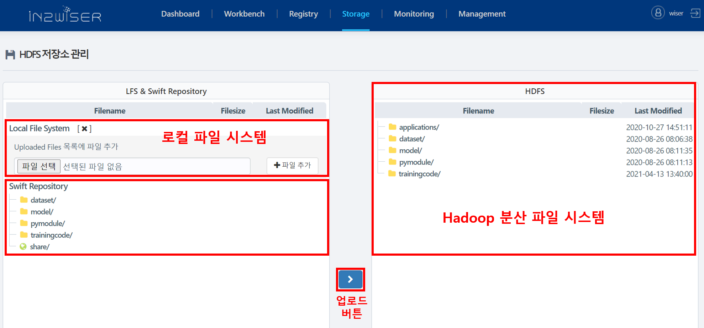
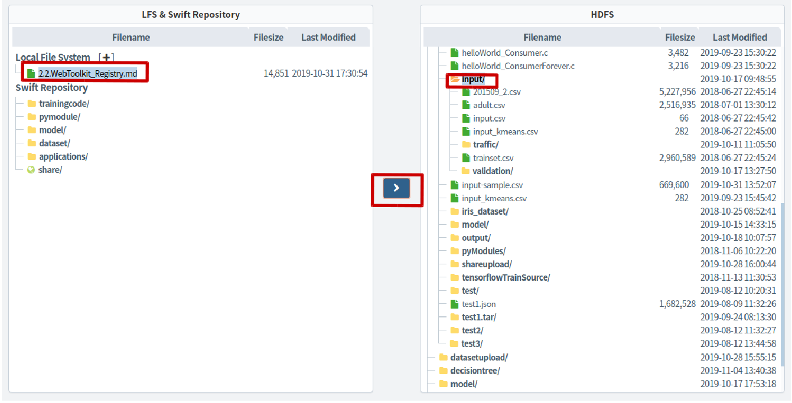
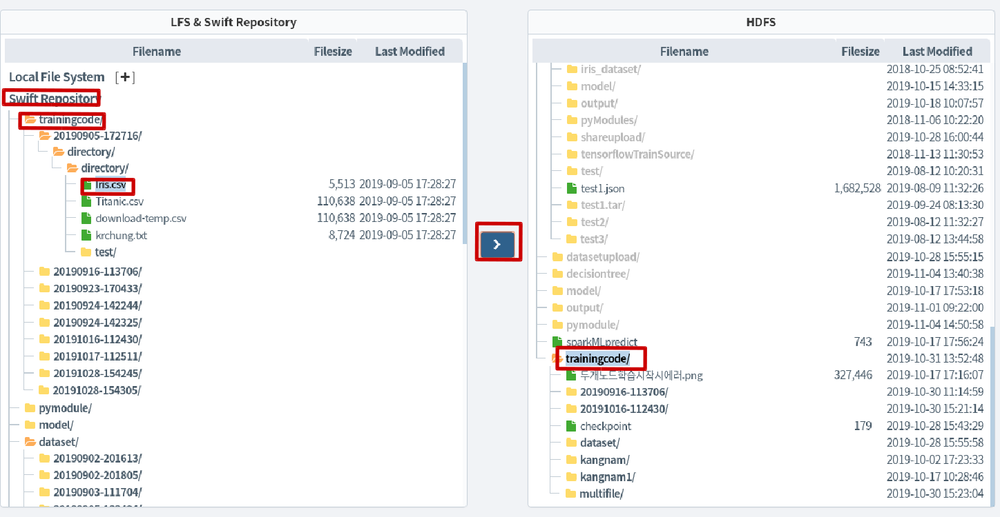
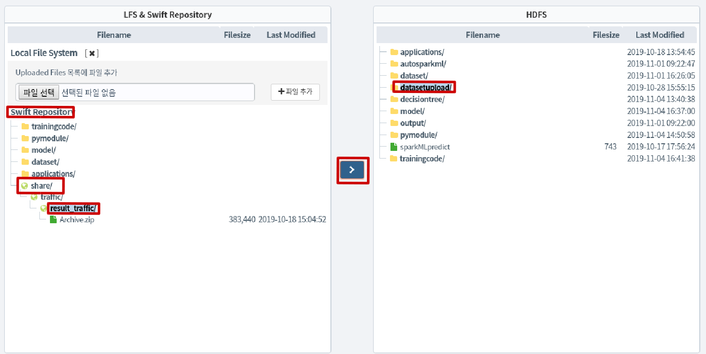
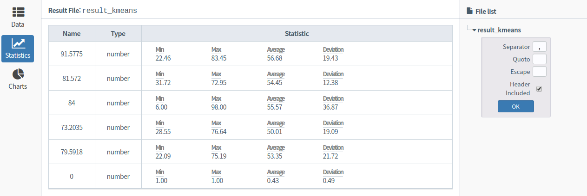
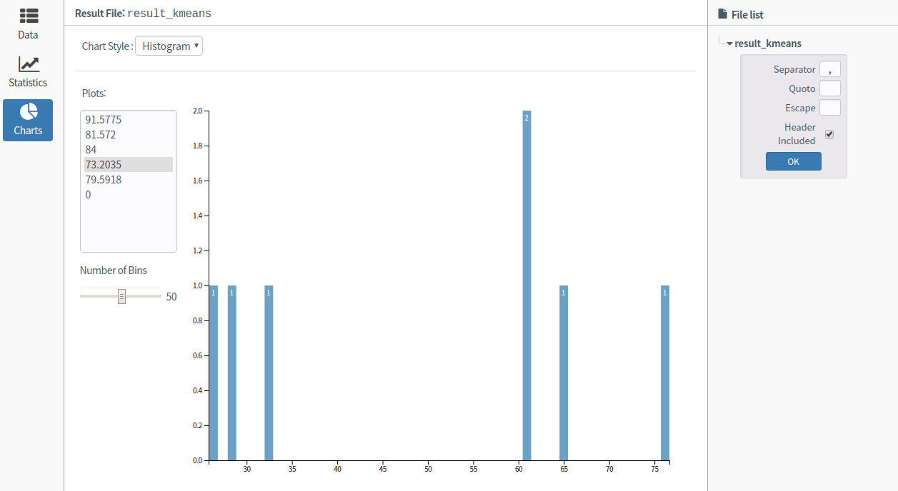
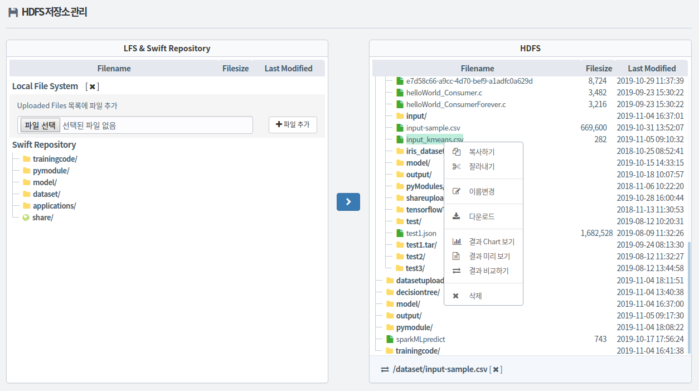
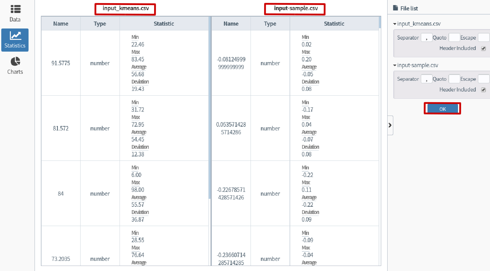

# HDFS 저장소 관리
---
IN2WISER 는 **하둡파일시스템(HDFS)** 을 기본적으로 사용합니다. IN2WISER 웹툴킷에서는 **Stroage** 메뉴를 통해 사용자의 로컬파일시스템(Local File System, LFS) 의 파일/폴더 또는 Swift Repository의 파일/폴더를 HDFS에 업로드 하거나 다운로드 하기 위한 인터페이스를 제공합니다. 

Swift Repository 의 파일 또는 폴더는 오른쪽 버튼을 클릭 후, '다운로드' 버튼을 클릭하여 로컬파일시스템으로 다운로드 가능합니다. 한번에 한개의 파일을 선택 할 수 있으며, 선택한 파일을 해지하고자 하는 경우에는 'Repository선택초기화' 버튼을 클릭해서 해지합니다.

HDFS 의 특정 폴더에 마우스를 오버하고, 오른쪽 클리을 하면,
- 새폴더 생성
- 폴더 복사하기
- 폴더 잘라내기
- 폴더 이름변경

을 할 수 있는 네개의 메뉴를 이용 할 수 있습니다.

새로운 폴더를 생성하고자 할 경우 새폴더 메뉴를 클릭하여 폴더명을 입력한 후 생성 버튼을 클릭합니다.

HDFS 에 저장되어있는 특정 파일에 마우스를 오버하고, 오른쪽 클릭을 하면,

- 파일 복사하기
- 파일 잘라내기
- 파일 이름변경
- 파일 다운로드
- 결과(파일) Chart보기
- 결과(파일) 미리보기
- 결과(파일) 비교하기
- 파일 삭제

메뉴를 이용할 수 있습니다.

## 사용자 기본 파일경로

IN2WISER 웹툴킷의 Storage에서 사용하는 경로는 **사용자 기본 파일경로** 를 생략하여 보여줍니다. 따라서 *'dataset/...'* 을 입력한 경우, *'hdfs://{host}:{port}/user/{user_id}/dataset/...'* 로 변경되어 IN2WISER 에서 처리됩니다.

## 데이터 업로드

IN2WISER는 HDFS에 업로드 할 데이터 타입을 크게 다섯 가지로 분류하도록 권장합니다. 로컬파일시스템과 Swift Repository에 있는 파일 또는 폴더를 업로드 할 수 있습니다.
- dataset : 입력 데이터 파일
- model : 학습된 기계학습 모델의 파라미터가 저장된 파일
- applications : 엔진의 Writer 가 생성한 결과 파일
- trainingcode : 기계학습 코드 파일
- pymodule : 사용자 파이썬 코드 파일

따라서 IN2WISER를 설치하면 HDFS에 기본적으로 "dataset" , "model", "trainingcode", "pymodule" 폴더가 생성되어 있습니다. "applications" 폴더는 엔진 실행 시 생성됩니다. 업로드할 파일의 타입에 따라 상위 디렉토리를 먼저 선택한 후 하위 디렉토리를 선택하고 해당 위치에 파일을 업로드 합니다.

### Local File System
아래의 6단계 과정을 거쳐서 사용자의 로컬파일시스템의 파일들을 HDFS에 업로드 할 수 있습니다.
(1) + 버튼 클릭 후, (2) 파일선택 버튼을 클릭하면, 로컬파일시스템에 저장되어있는 디렉토리와 파일 목록이 보여집니다. (3) 업로드할 파일을 선택 후, (4)+파일추가 버튼을 클릭합니다. (복수개의 파일을 선택할 수 있습니다) (5) 선택한 파일들을 저장할 HDFS 폴더를 선택합니다. (6) 파일업로드 버튼을 클릭합니다.

### Swift Reopsitory
아래의 3 단계 과정을 거쳐서 Swift 저장소의 파일 또는 폴더를 HDFS에 업로드 할 수 있습니다.

(1) Swift Repository 에 저장되어있는 파일 또는 폴더 선택 (2) 선택한 파일 또는 폴더를 저장할 HDFS 폴더를 선택합니다. 이때, Swift Repository의 share 폴더를 제외한 폴더들은 동일한 이름의 HDFS 폴더에만 복사할 수 있습니다. (3) 파일업로드 버튼을 클릭합니다.

share 폴더에 저장된 파일 또는 폴더는 아래의 그림과 같이 HDFS 의 어느 폴더에든지 업로드 가능합니다.

### 결과 Chart 보기
CSV 파일 형식일 경우, 파일이름 옆에 나타나는 차트 보기 버튼을 클릭하면 다음과 같은 팝업창이 나타납니다. 오른쪽 "File list" 창에서 파일명을 클릭한 후 구분자 등을 입력하고 "OK" 버튼을 클릭하면 데이터를 확인할 수 있습니다.

"Statistics" 버튼을 클릭하여 통계 정보를 볼 수 있습니다.

"Charts" 버튼을 클릭하여 그래프를 그려볼 수 있습니다.

### 결과 미리 보기
파일이름 옆에 나타나는 텍스트 보기 버튼을 클릭하면 파일의 내용을 보여주는 창이 팝업됩니다. 화면 우측에서 파일명을 선택하고 최대로 보고자 하는 사이즈 (Max Length) 를 바이트 단위로 입력합니다. 디폴트로 1000 바이트가 설정되어 있습니다.

### 결과 비교 하기
두 개의 파일을 동시에 띄워서 비교할 때 사용합니다.
파일이름 옆에 나타나는 '결과비교하기' 버튼을 클릭합니다. 화면 아래쪽에 선택된 파일명이 나타납니다. 잘못 선택한 경우 x 버튼을 클릭하여 삭제합니다.

두 번째 파일이 있는 곳으로 디렉토리를 옮긴 후, 파일이름 옆에 나타나는 '결과비교하기' 버튼을 클릭합니다. 잘못 선택한 경우 x 버튼을 클릭하여 삭제합니다. 두 개의 파일이 모두 선택된 경우 두 개의 파일을 비교해서 보여주는 창이 나타납니다.

"OK" 버튼을 클릭하면 두개의 파일을 비교하여 보여줍니다.