# IN2WISER 웹툴킷 개요
---
**IN2WISER 웹툴킷** 은 사용자가 프레임워크를 효과적으로 사용할 수 있도록 지원하는 웹기반의 저작 도구입니다. **IN2WISER 웹툴킷** 은 워크플로우를 정의하고 실행하는 기능과 실행 과정을 모니터링하는 기능, 그리고 관련 데이터를 업로드하고 결과를 시각화하는 기능 등을 지원합니다. **IN2WISER 웹툴킷** 은 회원가입을 통해 로그인을 하여 사용하며 사용자별로 워크플로우를 관리합니다.

## 웹을 통한 접속 및 로그인
먼저 <a href="1.5.HowToRunFirst-1906.md">IN2WISER 인공지능 프레임워크 실행하기</a> 매뉴얼을 참고하여 IN2WISER 프레임워크를 구동합니다.
Chrome 브라우저(또는 HTML5 표준 호환 브라우저)를 열고 <a href="http://localhost:8902/">http://localhost:8902</a> 에 접속합니다. 로그인 페이지를 볼 수 있으며, 다음과 같이 기본적으로 제공하는 사용자 정보(관리자)가 저장되어 있습니다.

- User ID : `wiser`
- User Password : `wiser`

사용자 ID 와 암호를 입력한 후 로그인 합니다.

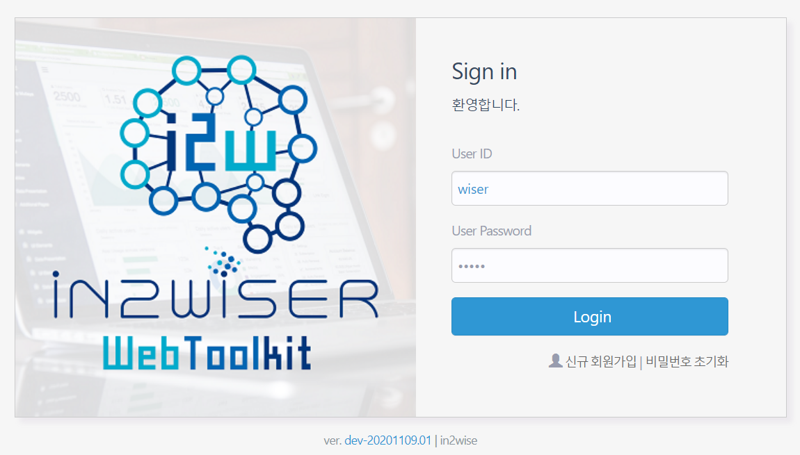

## 기능 및 메뉴 구성
IN2WISER 웹툴킷에 로그인을 하면 대시보드 화면이 보이고, 화면 상단에 다음과 같이 6개의 메뉴가 있습니다.

### Dashboard

대시보드에서는 웹툴킷에 로그인 한 사용자가 작성하여 저장하거나 실행한 워크플로우 정보 및 현재 서비스 되고 있는 정보를 한 눈에 파악할 수 있습니다. (다른 사용자가 작성하여 저장하거나 실행한 워크플로우는 나타나지 않습니다.) *Workflow TOP 10* 에서는 수행된 워크플로우의 통계 정보(일별 배포된 워크플로우 개수, 일별 실행중인 워크플로우 개수, 배포된 엔진들의 상태)를 보여줍니다. *Workflow* 에서는 사용자가 작성하여 저장한 워크플로우의 리스트를 보여줍니다. 삭제(&#9747;) 버튼을 눌러 해당 워크플로우를 삭제할 수 있습니다. 또한 특정 기간에 작성된 워크플로우를 검색하여 볼 수 있습니다. *Services* 에서는 현재 서비스 되고 있는 서빙 엔진들(온디맨드방식 처리 엔진, 스트림방식 처리 엔진)의 세부 정보를 보여줍니다.

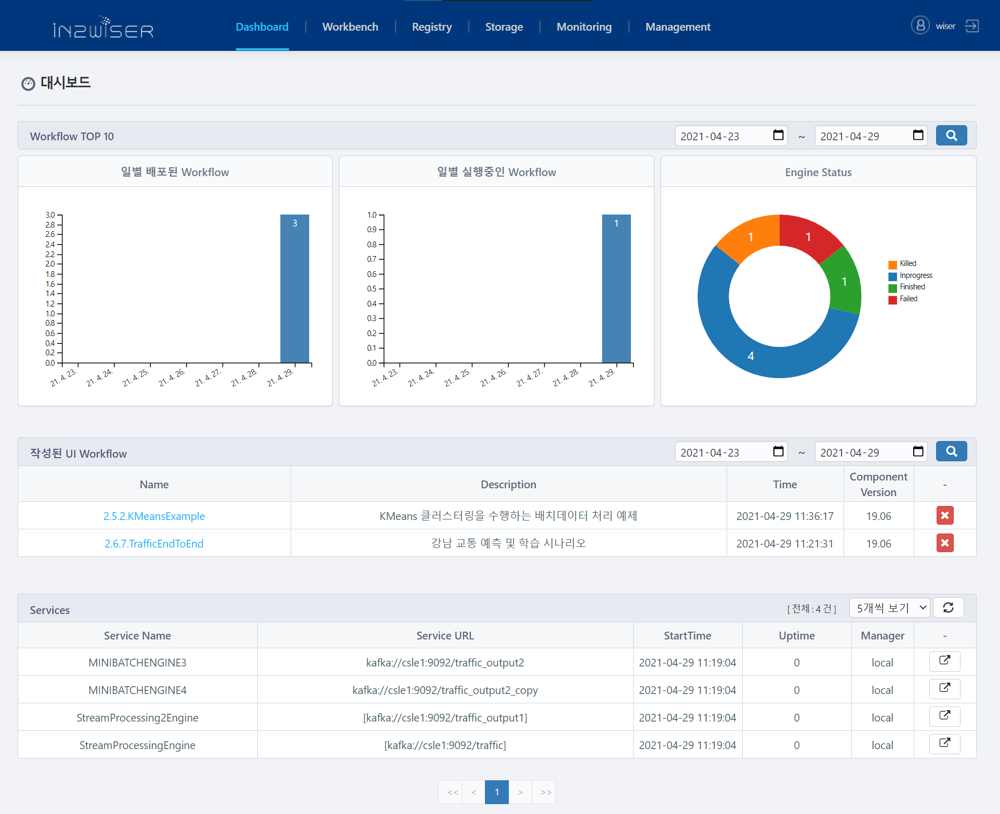

### Workbench
Workbench 는 편집화면과 운영화면으로 구성됩니다. 편집화면에서는 그래픽 기반의 워크플로우 편집 기능을 사용하여 워크플로우를 작성할 수 있습니다. 또한 워크플로우를 저장하고 로딩할 수 있으며 별도의 Json 파일로 Import/Export 할 수 있습니다. 구체적인 사용 방법은 <a href="2.2.1.WebToolkit_Workflow_1906.md">Workbench 편집화면 소개</a> 를 참조합니다.
편집화면에서 제작한 인공지능 워크플로우는 운영화면에서 빌드하고 배포할 수 있습니다. 구체적인 사용방법은 구체적인 사용 방법은 <a href="2.2.2.WebToolkit_Operating_1906.md">Workbench 운영화면 소개</a> 를 참조합니다.

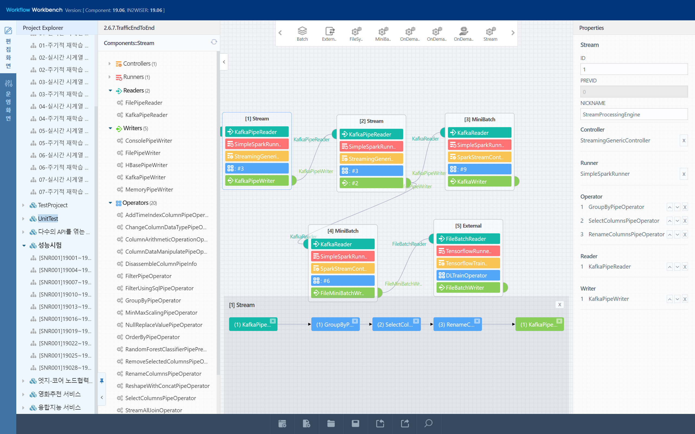

### Registry
Registry 는 IN2WISER를 이용한 인공지능 서비스 제작에 필요한 다양한 종류의 자원들을 등록하고 관리하는 기능을 제공합니다. 등록할 수 있는 자원의 유형은 **API, Container Image, Dataset, ML Model, DL Model, Platform, PyModule, Training Code, Authentication, Datasource, Subscripion 입니다.** 자원을 등록할 때에는 자원 유형을 선택한 후, 우측 상단의 +Register 버튼을 누르고, 해당 자원의 주요 정보를 입력하고 저장해야합니다. 구체적인 사용 방법은 <a href="2.3.WebToolkit_Registry.md">Registry 소개</a> 를 참조합니다.
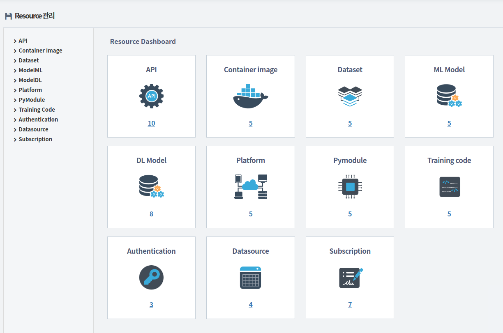

### Storage
IN2WISER는 **하둡파일시스템(HDFS)** 을 기본 저장소로 사용합니다. HDFS 저장소에서는 사용자의 로컬파일시스템과 Swift 저장소에 저장되어있는 파일이나 폴더를 HDFS에 업로드 하거나 다운로드 하기 위한 인터페이스를 제공합니다. 워크플로우에서 사용하는 데이터 파일, 모델 파일, 워크플로우 실행 결과 파일, 코드 등을 관리할 수 있습니다. 사용자가 원하는 파일 내용을 확인하거나 신규 디렉토리를 생성하고 파일을 업로드할 수 있는 기능 등을 제공합니다. 구체적인 사용 방법은 <a href="2.4.WebToolkit_Repository_1906.md"> HDFS 저장소 관리</a> 를 참조합니다.

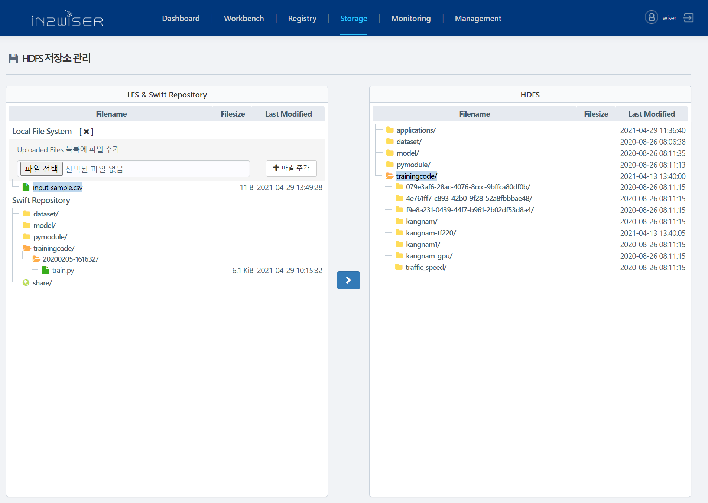

### Monitoring
진행내역/상태 모니터링에서는 (1) IN2WISER에 제출된 워크플로우(워크플로우에 속한 엔진 포함)의 목록 및 상태를 확인할 수 있습니다. 또한 워크플로우 및 엔진의 Status에 따라 실행 중인 워크플로우 및 엔진을 종료(&#9724;)하거나, 재실행(&#9654;)할 수 있습니다. 또한 *Workflow Histroy* 탭에서 엔진이 실행 되어 생성된 결과파일을 확인하고 그래프로 시각화 하거나 로그 기록을 볼 수 있습니다. 구체적인 사용 방법은 <a href="2.5.WebToolkit_Monitoring_1906.md"> 모니터링 소개</a> 를 참조합니다.

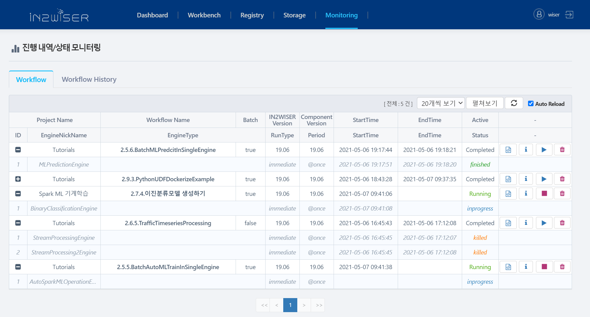

### Management (관리자 메뉴)
Management 탭은 관리자 권한을 가진 사용자만 접근할 수 있습니다. *System Configuration* 에서는 웹툴킷 관리자가 쉽게 웹툴킷 정보(게이트웨이 Ip, Port, 버전 정보 등)를 확인하고 수정할 수 있습니다. *User Configuration* 에서는 회원 목록을 확인하고 회원 가입 승인, 관리자 권한 부여, 회원 삭제 등을 수행할 수 있습니다.  

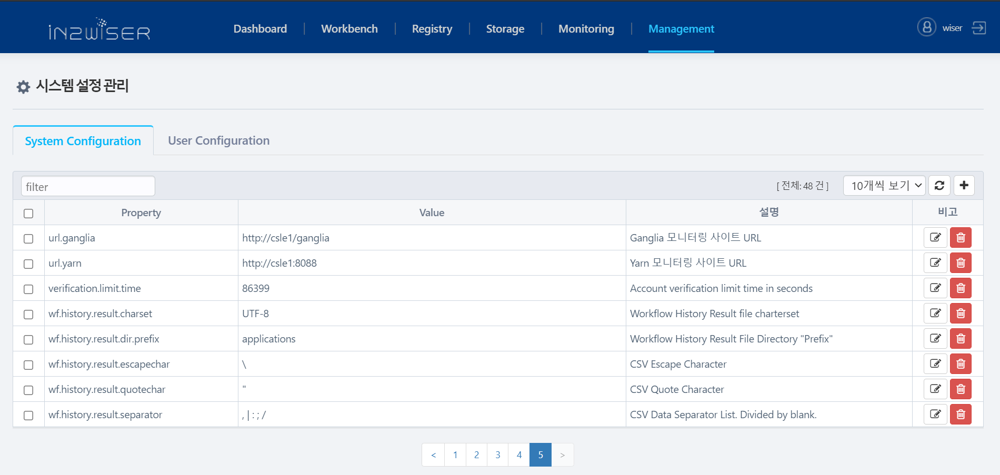

## 회원 가입

### 회원 가입 요청하기 (신규회원)
IN2WISER 웹툴킷은 회원가입을 통해 로그인을 하여 사용하며 사용자별로 워크플로우를 관리합니다. 자신의 계정을 생성하려면 로그인 화면에서 "신규 회원가입" 버튼을 클릭하여 회원가입을 수행 합니다. 회원 가입을 위한 사용자 정보를 입력하고, "가입요청" 버튼을 클릭합니다.

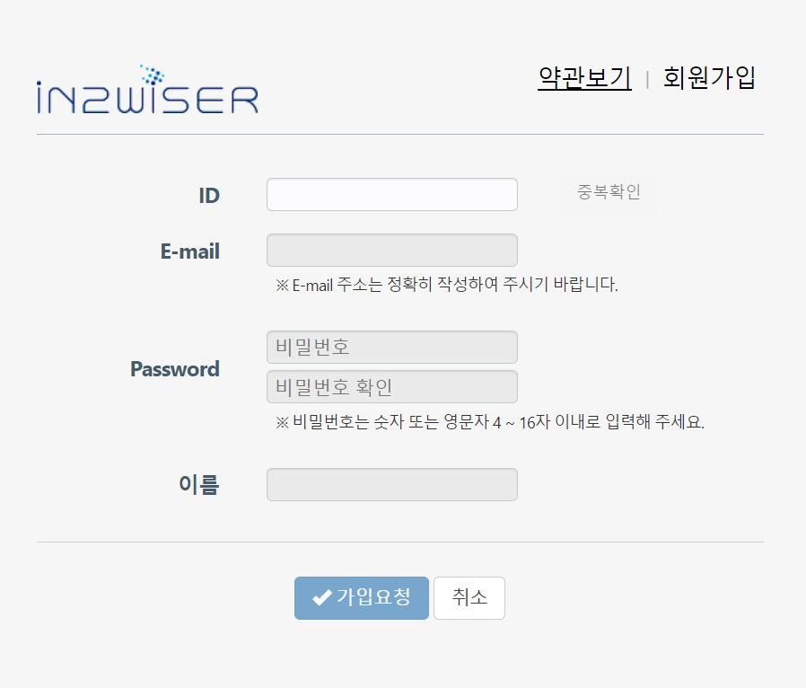

 IN2WISER 웹툴킷은 관리자가 최종승인을 내려줘야 가입이 완료됩니다.

### 회원 가입 승인하기 (관리자)

회원가입 요청을 승인하는 작업은 관리자만 가능합니다. 관리자로 로그인하면, 위에서 회원 가입을 요청한 사용자의 가입 상태(Activated)가 승인요청중이 되어있는것을 확인할 수 있습니다. 관리자는 해당 사용자를 **가입승인** 버튼을 클릭하여 승인해줍니다. 나아가, 해당 사용자에게 **관리자 권한 부여** 를 할 수도 있습니다.

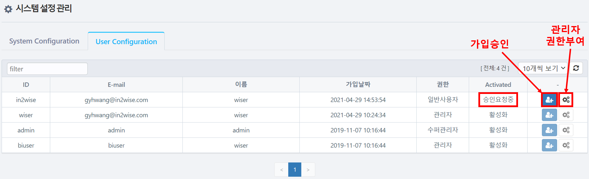

가입 승인을 완료하면 신규 회원의 가입 상태(Activated) 가 '활성화' 되어있는 것을 알 수 있습니다.

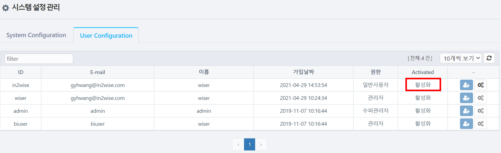

관리자가 회원 가입 승인을 해준 사용자는 아래와 같이 로그인 할 수있습니다.

처음 로그인한 사용자는 웹툴킷의 관리자 메뉴(Management) 를 제외한 나머지 기능을 이용할 수 있으며 다음과 같은 화면으로 로그인됩니다.
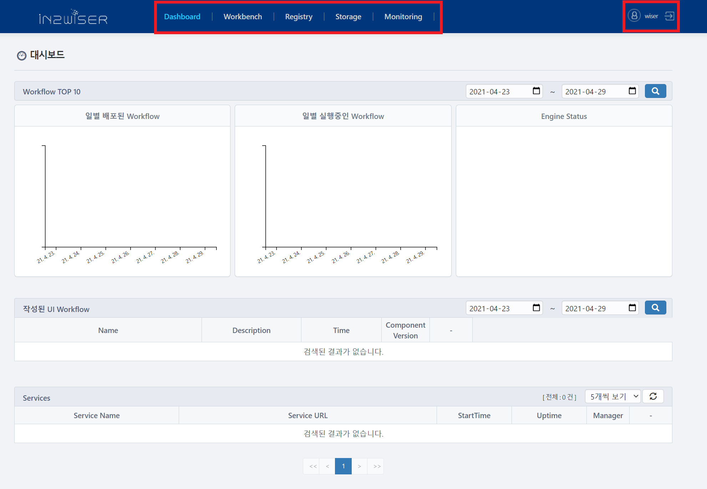

## Offline 회원 가입
지메일 기반 회원 가입 처리 기능의 보완을 위해 Offline 기반 회원 가입 기능이 추가 되었습니다.
해당 기능은, 2021-03-30 이후 배포된 버전에서만 동작하며, UIDB 상의 system_configuration 테이블 상에 다음 값을 추가 하여야 합니다. 값을 추가한 후에는 웹툴킷을 재구동 해야 합니다.

name  | config | 비고
--|--|--
beeai.webtoolkit.register | offline  | 기존과 같이 이메일 인증 기반은 online 으로 설정

## 회원 관리
IN2WISER 웹툴킷은 회원을 **일반사용자/관리자/슈퍼관리자** 로 권한을 나누어 관리합니다. 일반사용자 계정은 Management 메뉴에 접근할 수 없습니다. 관리자 및 슈퍼관리자 계정은Management 메뉴에 접근 가능하고 기능을 사용할 수 있습니다. 다만, 관리자 계정은 **Management** 메뉴의  *User Configuration* 탭에서 일반사용자의 회원 가입 승인, 관리자 권한 부여, 회원 삭제 등을 수행할 수 있습니다. 관리자의 권한을 일반사용자로 바꾸거나 관리자 회원을 삭제하는 것은 수퍼관리자 계정만 가능합니다.