# Registry 소개
---
BeeAI Registry 는 인공지능 서비스 제작 및 운영에 필요한 다양한 종류의 자원들을 등록하고 관리하는 기능을 제공합니다. 등록할 수 있는 자원의 유형은 11가지 종류이며, *API, Container Image, Dataset, ML Model, DL Model, Platform, PyModule, Training Code, Authentication, Datasource, Subscripion 입니다.* Registry 의 **Resource Dashboard** 는 유형 별 등록된 자원의 개수를 표시합니다.

Registry 에 등록되어있는 자원은 Workbecnch 편집화면의 "리소스 매핑" 버튼을 활용하여 불러오기 가능합니다.

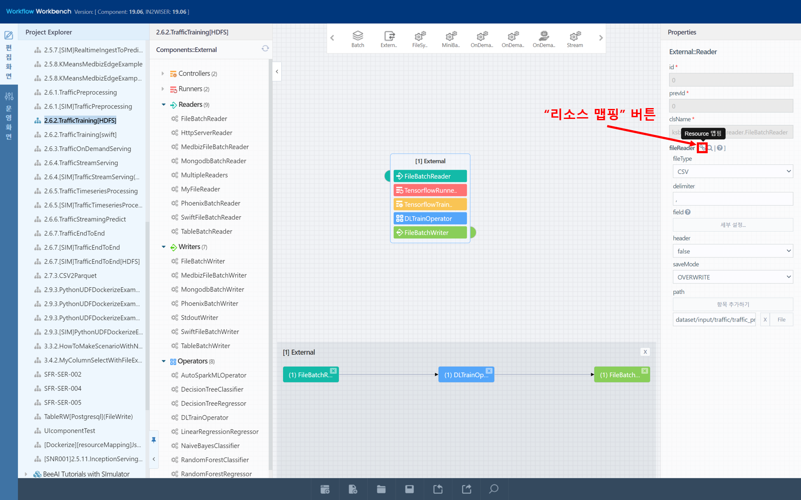

## API

인공지능 서비스 제작을 위해 필요한 외부의 개발용 API를 등록할 수 있습니다. API List 는 IN2WISER Repository 에 등록되어있는 API들의 목록을 보여줍니다. 신규 API는 우측 상단의 +Register 버튼을 이용해서 등록할 수 있으며, 휴지통 버튼을 이용해서 삭제할 수 있습니다. API 등록 및 관리를 위한 자세한 설명은 <a href="./2.3.1.APIRegister.md">API 등록 및 관리 방법</a> 을 참고하시기 바랍니다.

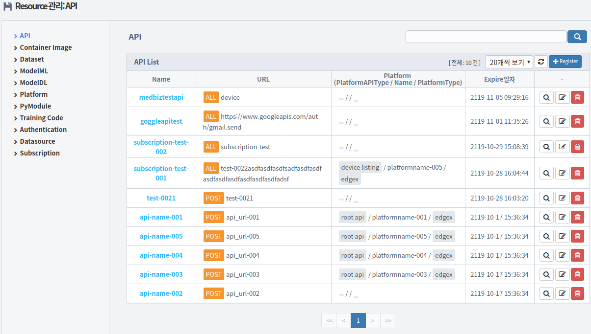

## Container Image
인공지능 서비스 제작을 위해 필요한 Container Image 를 등록하고 관리합니다.

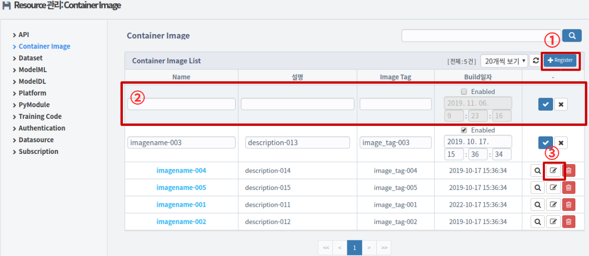

**&#10112;**  +Register 버튼을 클릭하면, **&#10113;** 신규 Container 등록을 위한 정보 입력란이 활성화 됩니다. 입력해야할 정보들의 의미는 다음과 같습니다.

- ### Container Image 리소스 등록 정보 ###

이름  | 설명
--|--
Name  |  리소스에 대한 이름
설명  |  리소스에 대한 설명
Image Tag  |  Container Image 를 docker 를 통해 생성할 때 부여하는 이름
Build일자  |  Container Image 가 만들어진 날짜

저장되어있는 Container Image 정보를 수정하려면, **&#10114;** Edit 버튼을 클릭해서 수행 할 수 있습니다. Edit 버튼을 클릭하면 다음과 같은 화면이 보이게 되며, Container Image 의 Schemas 정보도 입력할 수 있습니다.

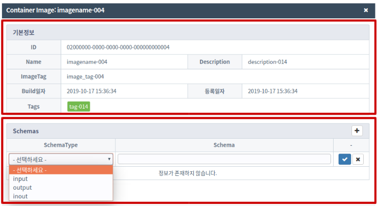

- ### Container Image 리소스 등록 정보

이름  | 설명  | M/O/N(ot) | RW/RO/WO | R(epeated)/N(ot) | 비고  
--|---|--|--|--|--
기본정보  | Container Image 리소스의 기본정보  | M  | RW  | N  | -
Schemas  |  해당 API 리소스를 통해 입력 또는 출력 되는 정보의 샘플 등을 Json 포맷으로 저장 |O|RW|Y| Schema는 Input, Output, InOut 중 하나를 설정할 수 있음   

- ### Container Image 기본정보

이름  | 설명  | M/O/N(ot) | RW/RO/WO | R(epeated)/N(ot) | 비고  
--|---|--|--|--|--
ID  | 시스템에서 자동으로 생성하는 고유 식별자  | N  | RO  | N  | UUID
Name  | 사용자가 부여하는 리소스 이름  | M  | RW  | N  | 시스템 설정에 따라 중복을 허용하지 않을 수 있음
Description  | 리소스에 대한 설명  | O  |RW   | N  | -
ImageTag  | Container Image 를 docker 를 통해 생성할 때 사용자가 부여하는 이름  | M | RW  | N  | -
Build일자  | Container Image가 만들어진 날짜  | O  | RW  | N  | -
등록일자  | 리소스가 시스템에 등록된 일자  | N  | RO  | N  | -  
Tags  | 리소스를 검색하기 위한 키워드  | O  | RW  | Y  | -

## Dataset
인공지능 서비스 제작을 위해 필요한 데이터셋을 등록하고 관리합니다.

**&#10112;**  +Register 버튼을 클릭하면, **&#10113;** 신규 Dataset 등록을 위한 기본 정보 입력란이 활성화 됩니다.

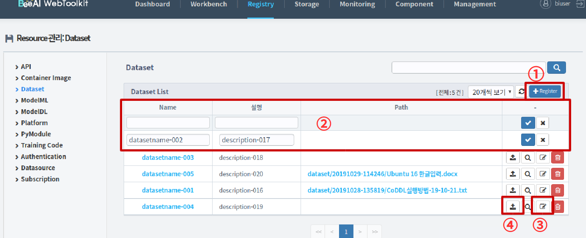

입력해야할 기본 정보들의 의미는 다음과 같습니다.

이름  | 설명
--|--
Name  |  리소스에 대한 이름
설명  |  리소스에 대한 설명
Path  |  리소스가 저장된 Swift Repository 상의 경로

저장되어있는 Dataset 정보를 수정하려면, **&#10114;** Edit 버튼을 클릭해서 수행 할 수 있습니다. Edit 버튼을 클릭하면 다음과 같은 화면이 보이게 되며, **&#10116;** Swift Repository 에 업로드 할 Dataset 의 Path 를 입력할 수 있고, 로컬파일시스템과 HDFS 의 파일 또는 폴더를 업로드 할 수 있습니다. 폴더의 경우에는 '올려서압축풀기' 체크박스를 선택하여 업로드 후 압축을 출어서 저장할 수 있습니다. **&#10117;**  데이터셋의 Schema 정보도 입력할 수 있습니다.

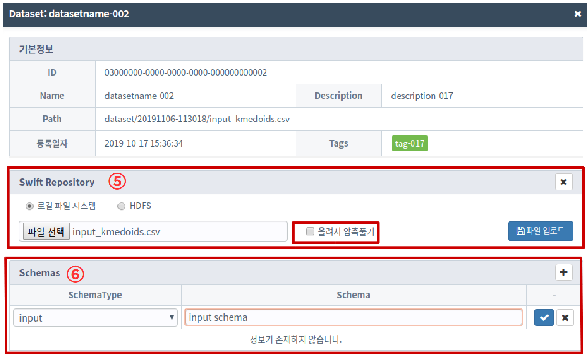

상기 과정을 통해서 등록된 Dataset 리소스 등록정보의 상세 설명은 다음과 같습니다.
- ### DataSet 리소스 등록 정보 ###

이름  | 설명  | M/O/N(ot) | RW/RO/WO | R(epeated)/N(ot) | 비고  
--|---|--|--|--|--
기본정보  | 리소스의 기본정보  | M  | RW  | N  | -
Swift Repository  | 리소스가 저장되는 Swift Repository 정보로 파일을 등록/삭제/다운로드/HDFS Storage로 복사 할 수 있음  | O  | RW  | N  | 로컬 파일시스템 또는 HDFS Storage로 부터 업로드 할 수 있음
Schemas  |  해당 API 리소스를 통해 입력 또는 출력 되는 정보의 샘플 등을 Json 포맷으로 저장 |O|RW|Y| Schema는 Input, Output, InOut 중 하나를 설정할 수 있음   
- Swift Repository로의 업로드는 기본적으로 파일 단위로만 가능하며, 디렉토리를 업로드 하고 싶은 경우, 해당 디렉토리를 압축한 후에 "올려서 압축풀기"를 선택하여 업로드 할 수 있다.
- 리소스를 삭제하면, 관련된 Swift Repository 상의 파일도 삭제 처리 된다.

## ML Model
인공지능 서비스 제작을 위해 필요한 머신러닝 모델을 등록하고 관리합니다.

**&#10112;**  +Register 버튼을 클릭하면, **&#10113;** 신규 ML Model 등록을 위한 기본 정보 입력란이 활성화 됩니다.

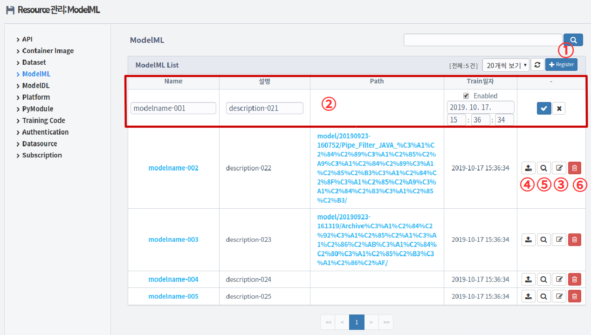

ML Model List 테이블에 보이는 정보는 다음과 같습니다.

이름  | 설명
--|---
Name  |  리소스에 대한 이름
설명  |  리소스에 대한 설명
Path  |  리소스가 저장된 Swift Repository 상의 경로
Train일자  | ML Model 리소스가 학습된 날짜

저장되어있는 ML Model 정보를 수정하려면, **&#10114;** Edit 버튼을 클릭해서 수행 할 수 있습니다.
**&#10115;** Path 수정 버튼을 이용라면, 아래와 같은 새 창이 열리며 ML Model 을 Swift Repository 에 업로드하고, 모델의 Signitures 를 등록할 수 있게됩니다.

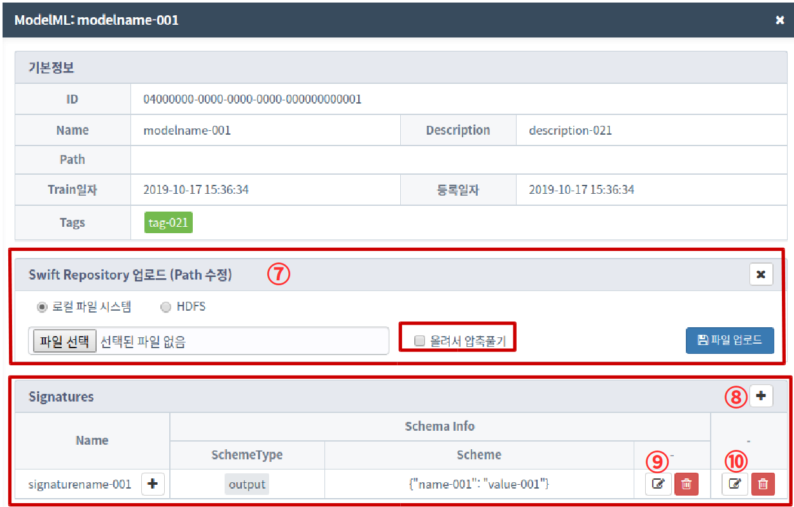

**&#10118;** Swift Repository 에 업로드 할 ML Model 의 Path 를 선택하여, 로컬파일시스템과 HDFS 에 저장되어있는 ML Model을 업로드 할 수 있습니다. 폴더의 경우에는 '올려서압축풀기' 체크박스를 선택하여 업로드 후 압축을 출어서 저장할 수 있습니다.
**&#10119;** ML Model 의 Signitures 정보도 입력할 수 있습니다. Signitures 정보를 수정하려면, **&#10121;** Signiture 수정 버튼을 클릭하여 수정가능합니다. **&#10120;** 를 이용하면 Signiture 의 schema 정보를 수정할 수 있습니다.

- ### ML Model 리소스 등록 정보 ###
이름  | 설명  | M/O/N(ot) | RW/RO/WO | R(epeated)/N(ot) | 비고  
--|---|--|--|--|--
기본정보  | 리소스의 기본정보  | M  | RW  | N  | -
Swift Repository  | 리소스가 저장되는 Swift Repository 정보로 파일을 등록/삭제/다운로드/HDFS Storage로 복사 할 수 있음  | O  | RW  | N  | 로컬 파일시스템 또는 HDFS Storage로 부터 업로드 할 수 있음
Signatures | 해당 모델에 대한 input 과 output 정보를 표현하는 것으로, 여기서는 schema를 통해 구체적인 input/output을 표현하고, signature는 이름만 가지고 있음  | O  | RW  | Y  | -
- signature는, 현재 Tensorflow Serving 기반에 대해서 만 지원한다.

- ### ML Model 기본정보 ###

이름  | 설명  | M/O/N(ot) | RW/RO/WO | R(epeated)/N(ot) | 비고  
--|---|--|--|--|--
ID  | 시스템에서 자동으로 생성하는 고유 식별자  | N  | RO  | N  | UUID
Name  | 사용자가 부여하는 리소스 이름  | M  | RW  | N  | 시스템 설정에 따라 중복을 허용하지 않을 수 있음
Description  | 리소스에 대한 설명  | O  |RW   | N  | -
Path  | 리소스가 저장된 Swift Repository 상의 경로   | O  | RW  | N  | -
Train일자  | ML Model 리소스가 학습된 날짜  | O  | RW  | N  | -
등록일자  | 리소스가 시스템에 등록된 일자  | N  | RO  | N  | -  
Tags  | 리소스를 검색하기 위한 키워드  | O  | RW  | Y  | -

## DL Model
인공지능 서비스 제작을 위해 필요한 딥러닝 모델을 등록하고 관리합니다.

**&#10112;**  +Register 버튼을 클릭하면, **&#10113;** 신규 DL Model 등록을 위한 기본 정보 입력란이 활성화 됩니다.

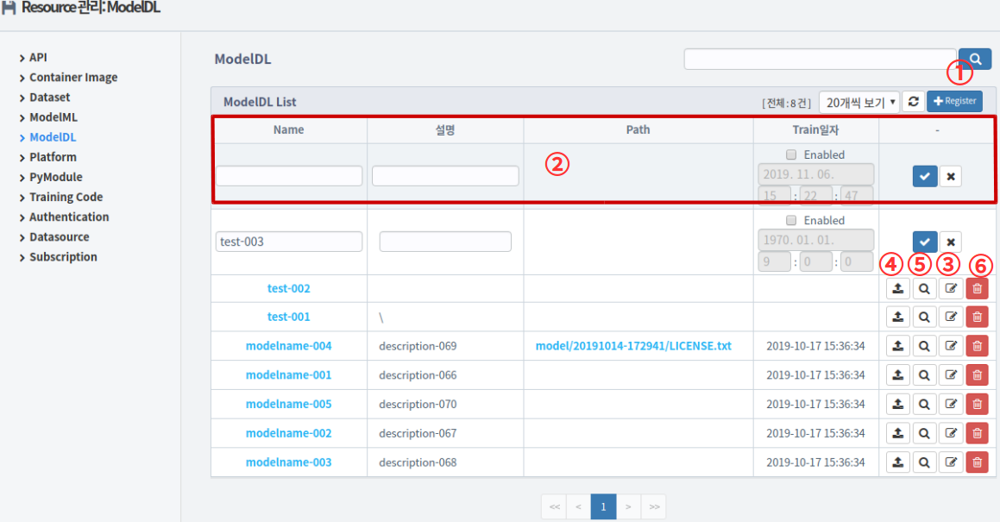

DL Model List 테이블에 보이는 정보는 다음과 같습니다.

이름  | 설명
--|---
Name  |  리소스에 대한 이름
설명  |  리소스에 대한 설명
Path  |  리소스가 저장된 Swift Repository 상의 경로
Train일자  | DL Model 리소스가 학습된 날짜

저장되어있는 DL Model 정보를 수정하려면, **&#10114;** Edit 버튼을 클릭해서 수행 할 수 있습니다.
**&#10115;** Path 수정 버튼을 이용라면, 아래와 같은 새 창이 열리며 DL Model 을 Swift Repository 에 업로드하고, 모델의 Signitures 를 등록할 수 있게됩니다.

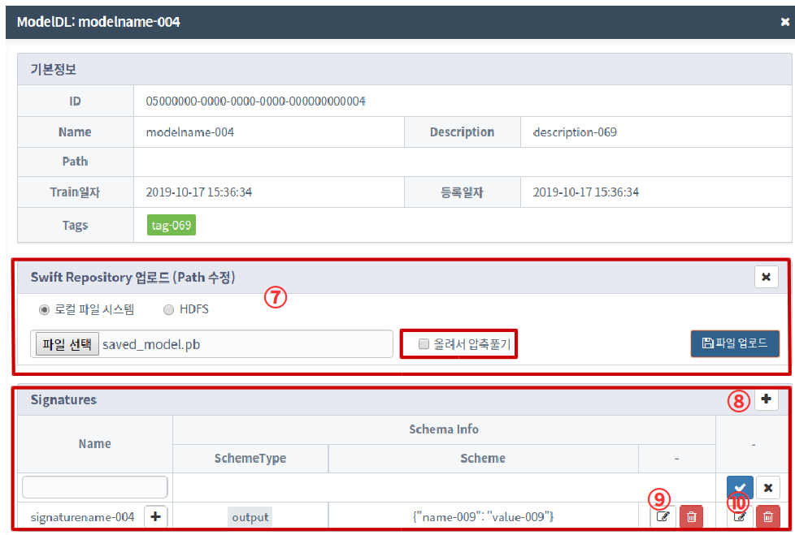

**&#10118;** Swift Repository 에 업로드 할 DL Model 의 Path 를 선택하여, 로컬파일시스템과 HDFS 에 저장되어있는 DL Model을 업로드 할 수 있습니다. 폴더의 경우에는 '올려서압축풀기' 체크박스를 선택하여 업로드 후 압축을 출어서 저장할 수 있습니다.
**&#10119;** DL Model 의 Signitures 정보도 입력할 수 있습니다. Signitures 정보를 수정하려면, **&#10121;** Signiture 수정 버튼을 클릭하여 수정가능합니다. **&#10120;** 를 이용하면 Signiture 의 schema 정보를 수정할 수 있습니다.

- ### DL Model 리소스 등록 정보 ###

이름  | 설명  | M/O/N(ot) | RW/RO/WO | R(epeated)/N(ot) | 비고  
--|---|--|--|--|--
기본정보  | 리소스의 기본정보  | M  | RW  | N  | -
Swift Repository  | 리소스가 저장되는 Swift Repository 정보로 파일을 등록/삭제/다운로드/HDFS Storage로 복사 할 수 있음  | O  | RW  | N  | 로컬 파일시스템 또는 HDFS Storage로 부터 업로드 할 수 있음
Signatures | 해당 모델에 대한 input 과 output 정보를 표현하는 것으로, 여기서는 schema를 통해 구체적인 input/output을 표현하고, signature는 이름만 가지고 있음  | O  | RW  | Y  | -
- signature는, 현재 Tensorflow Serving 기반에 대해서만 지원한다.

- ### DL Model 기본정보 등록 정보

이름  | 설명  | M/O/N(ot) | RW/RO/WO | R(epeated)/N(ot) | 비고  
--|---|--|--|--|--
ID  | 시스템에서 자동으로 생성하는 고유 식별자  | N  | RO  | N  | UUID
Name  | 사용자가 부여하는 리소스 이름  | M  | RW  | N  | 시스템 설정에 따라 중복을 허용하지 않을 수 있음
Description  | 리소스에 대한 설명  | O  |RW   | N  | -
Path  | 리소스가 저장된 Swift Repository 상의 경로   | O  | RW  | N  | -
Train일자  | DL Model 리소스가 학습된 날짜  | O  | RW  | N  | -
등록일자  | 리소스가 시스템에 등록된 일자  | N  | RO  | N  | -  
Tags  | 리소스를 검색하기 위한 키워드  | O  | RW  | Y  | -

## Platform
인공지능 서비스 제작을 위해 필요한 외부의 플랫폼을 등록하고 관리합니다.

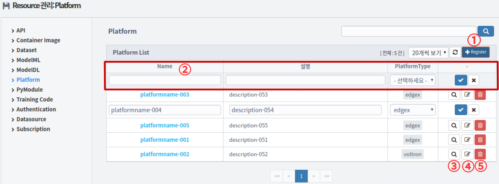

Platform List 테이블의 세부 정보는 다음과 같습니다.

이름  | 설명
--|---
Name  |  리소스에 대한 이름
설명  |  리소스에 대한 설명
PlatformType  | 플랫폼 유형 (Medbiz, EdgeX, Voltron) 

**&#10112;**  +Register 버튼을 클릭하면, **&#10113;** 신규 Platform 등록을 위한 기본 정보 입력란이 활성화 됩니다.
**&#10115;** Edit 버튼을 클릭하면, Platform 의 기본정보를 수정할 수 있습니다.

**&#10114;** 돋보기 버튼을 클릭하면, Platform 리소스의 세부 정보를 확인할 수 있는 창이 뜹니다.

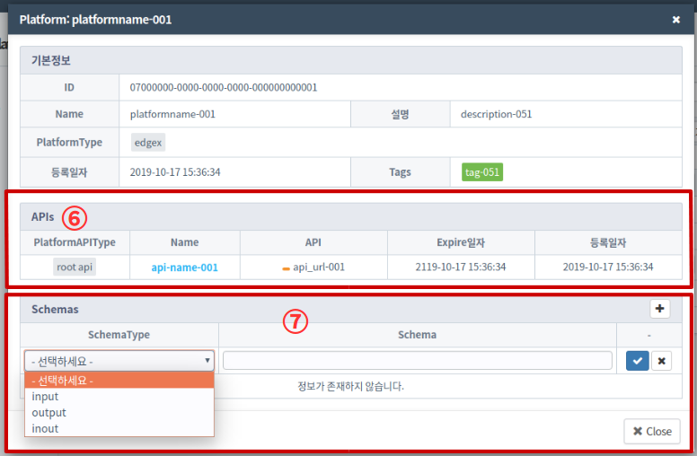

**&#10117;** 에서는 Platform 과 연결되어있는 API 목록을 확인할 수 있습니다.
**&#10118;** 에서는 Schemas 정보를 입력할 수 있습니다.

- ### Platform 리소스 등록 정보 ###

이름  | 설명  | M/O/N(ot) | RW/RO/WO | R(epeated)/N(ot) | 비고  
--|---|--|--|--|--
기본정보  | 리소스의 기본정보  | M  | RW  | N  | -
APIs | 리소스에 속한 API 리소스 정보 | O|RW|Y|-
Schemas  |  해당 API 리소스를 통해 입력 또는 출력 되는 정보의 샘플 등을 Json 포맷으로 저장 |O|RW|Y| Schema는 Input, Output, InOut 중 하나를 설정할 수 있음   
- Platform 과 API 간의 매핑은, 현재는 API 리소스 화면에서만 가능하다.

- ### Platform 기본정보 ###

이름  | 설명  | M/O/N(ot) | RW/RO/WO | R(epeated)/N(ot) | 비고  
--|---|--|--|--|--
ID  | 시스템에서 자동으로 생성하는 고유 식별자  | N  | RO  | N  | UUID
Name  | 사용자가 부여하는 리소스 이름  | M  | RW  | N  | 시스템 설정에 따라 중복을 허용하지 않을 수 있음
Description  | 리소스에 대한 설명  | O  |RW   | N  | -
PlatformType  | 플랫폼 유형 (EdgeX, Medbiz, Voltron)| M  | RW  | Y  |-  
등록일자  | 리소스가 시스템에 등록된 일자  | N  | RO  | N  | -  
Tags  | 리소스를 검색하기 위한 키워드  | O  | RW  | Y  | -

## PyModule
인공지능 서비스 제작을 위해 필요한 파이썬 모듈을 등록하고 관리합니다.

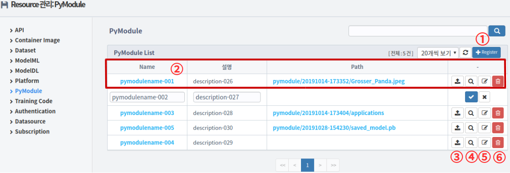

PyModule List 테이블의 세부 정보는 다음과 같습니다.

이름  | 설명
--|--
Name  |  리소스에 대한 이름
설명  |  리소스에 대한 설명
Path  |  리소스가 저장된 Swift Repository 상의 경로

**&#10112;**  +Register 버튼을 클릭하면, **&#10113;** 신규 PyModule 등록을 위한 기본 정보 입력란이 활성화 됩니다.
**&#10116;** Edit 버튼을 클릭하면, PyModule 의 기본정보를 수정할 수 있습니다.

**&#10115;** 돋보기 버튼을 클릭하면, PyModule 리소스의 세부 정보를 확인할 수 있는 창이 뜹니다.

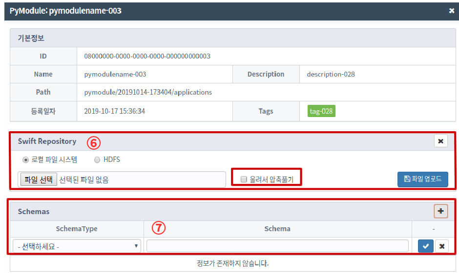

**&#10117;** Swift Repository 에 업로드 할 PyModule 의 Path 를 선택하여, 로컬파일시스템과 HDFS 에 저장되어있는 DL Model을 업로드 할 수 있습니다. 폴더의 경우에는 '올려서압축풀기' 체크박스를 선택하여 업로드 후 압축을 출어서 저장할 수 있습니다.
**&#10117;** PyModule 의 Schema 정보도 입력할 수 있습니다.

- ### PyModule 리소스 등록 정보 ###

이름  | 설명  | M/O/N(ot) | RW/RO/WO | R(epeated)/N(ot) | 비고  
--|---|--|--|--|--
기본정보  | 리소스의 기본정보  | M  | RW  | N  | -
Swift Repository  | 리소스가 저장되는 Swift Repository 정보로 파일을 등록/삭제/다운로드/HDFS Storage로 복사 할 수 있음  | O  | RW  | N  | 로컬 파일시스템 또는 HDFS Storage로 부터 업로드 할 수 있음
Schemas  |  해당 API 리소스를 통해 입력 또는 출력 되는 정보의 샘플 등을 Json 포맷으로 저장 |O|RW|Y| Schema는 Input, Output, InOut 중 하나를 설정할 수 있음   
- Swift Repository로의 업로드는 기본적으로 파일 단위로만 가능하며, 디렉토리를 업로드 하고 싶은 경우, 해당 디렉토리를 압축한 후에 "올려서 압축풀기"를 선택하여 업로드 할 수 있다.
- 리소스를 삭제하면, 관련된 Swift Repository 상의 파일도 삭제 처리 된다.

- ### PyModule 기본정보 ###

이름  | 설명  | M/O/N(ot) | RW/RO/WO | R(epeated)/N(ot) | 비고  
--|---|--|--|--|--
ID  | 시스템에서 자동으로 생성하는 고유 식별자  | N  | RO  | N  | UUID
Name  | 사용자가 부여하는 리소스 이름  | M  | RW  | N  | 시스템 설정에 따라 중복을 허용하지 않을 수 있음
Description  | 리소스에 대한 설명  | O  |RW   | N  | -
등록일자  | 리소스가 시스템에 등록된 일자  | N  | RO  | N  | -  
Tags  | 리소스를 검색하기 위한 키워드  | O  | RW  | Y  | -

## Training Code
인공지능 서비스 제작을 위해 필요한 ML/DL 모델 학습 코드를 등록하고 관리합니다.

**&#10112;**  +Register 버튼을 클릭하면, **&#10113;** 신규 Training Code 등록을 위한 기본 정보 입력란이 활성화 됩니다.

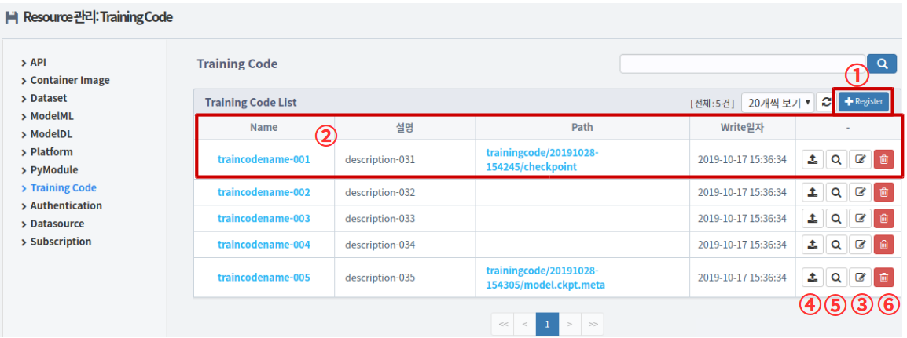

Training Code List 테이블에 보이는 정보는 다음과 같습니다.

이름  | 설명
--|--
Name  |  리소스에 대한 이름
설명  |  리소스에 대한 설명
Path  |  리소스가 저장된 Swift Repository 상의 경로
Write일자  | 리소스가 만들어진 날짜

저장되어있는 Training Code 정보를 수정하려면, **&#10114;** Edit 버튼을 클릭해서 수행 할 수 있습니다.
**&#10115;** Path 수정 버튼을 이용라면, 아래와 같은 새 창이 열리며 Training Code 를 Swift Repository 에 업로드하고, Schema 를 등록할 수 있게됩니다.

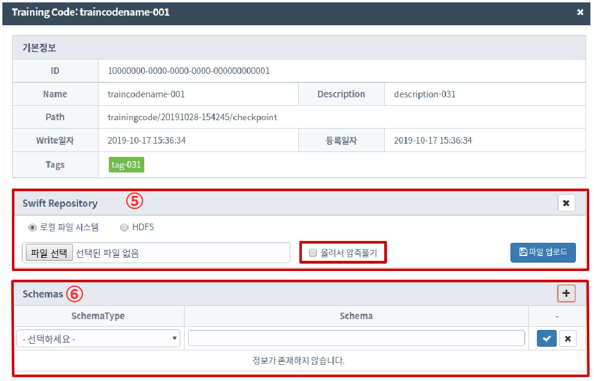

**&#10116;** Swift Repository 에 업로드 할 Training Code 의 Path 를 선택하여, 로컬파일시스템과 HDFS 에 저장되어있는 Training Code를 업로드 할 수 있습니다. 폴더의 경우에는 '올려서압축풀기' 체크박스를 선택하여 업로드 후 압축을 출어서 저장할 수 있습니다.
**&#10117;** Training Code 의 Schema 정보도 입력할 수 있습니다.

- ### Training Code 리소스 등록 정보 ###

이름  | 설명  | M/O/N(ot) | RW/RO/WO | R(epeated)/N(ot) | 비고  
--|---|--|--|--|--
기본정보  | 리소스의 기본정보  | M  | RW  | N  | -
Swift Repository  | 리소스가 저장되는 Swift Repository 정보로 파일을 등록/삭제/다운로드/HDFS Storage로 복사 할 수 있음  | O  | RW  | N  | 로컬 파일시스템 또는 HDFS Storage로 부터 업로드 할 수 있음
Schemas  |  해당 API 리소스를 통해 입력 또는 출력 되는 정보의 샘플 등을 Json 포맷으로 저장 |O|RW|Y| Schema는 Input, Output, InOut 중 하나를 설정할 수 있음   
- Swift Repository로의 업로드는 기본적으로 파일 단위로만 가능하며, 디렉토리를 업로드 하고 싶은 경우, 해당 디렉토리를 압축한 후에 "올려서 압축풀기"를 선택하여 업로드 할 수 있다.
- 리소스를 삭제하면, 관련된 Swift Repository 상의 파일도 삭제 처리 된다.

- ### TrainingCode 기본정보 ###

이름  | 설명  | M/O/N(ot) | RW/RO/WO | R(epeated)/N(ot) | 비고  
--|---|--|--|--|--
ID  | 시스템에서 자동으로 생성하는 고유 식별자  | N  | RO  | N  | UUID
Name  | 사용자가 부여하는 리소스 이름  | M  | RW  | N  | 시스템 설정에 따라 중복을 허용하지 않을 수 있음
Description  | 리소스에 대한 설명  | O  |RW   | N  | -
Write일자  | 리소스가 만들어진 날짜  | O  | RW  | N  | -
등록일자  | 리소스가 시스템에 등록된 일자  | N  | RO  | N  | -  
Tags  | 리소스를 검색하기 위한 키워드  | O  | RW  | Y  | -

## Authentication
인공지능 서비스 제작을 위해 필요한 인증/인가 용도의 Token 을 발생하고 관리합니다.

Authentication List 테이블에 보이는 정보는 다음과 같습니다.

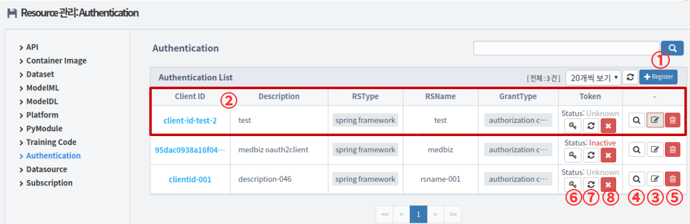

이름  | 설명
--|--
Client ID  | Authentication 리소스를 식별하기 위한 이름
Description  | Authentication 리소스에 대한 설명
RSType  | ClientID를 통해 접근하고자하는 Resource Server의 타입
RSName  | Resource Server 를 식별하기 위한 이름
Grant Type  | OAuth2 를 통해 리소스에 접근할 때의 접근 허용 방식
Token  | 해당 ClientID에 대한 Token을 발급받거나, 재발급 받거나, 발급받은 token을 삭제 하는 버튼이 차례대로 있음
- Token은 BeeAi Security Client 에서 제공하는 기능 이다.

**&#10112;**  +Register 버튼을 클릭하면, 신규 Authentication 등록을 위한 기본 정보 입력란 **⑩**  과 APIs 연결란 **⑪** 이 들어있는 창이 나타납니다.

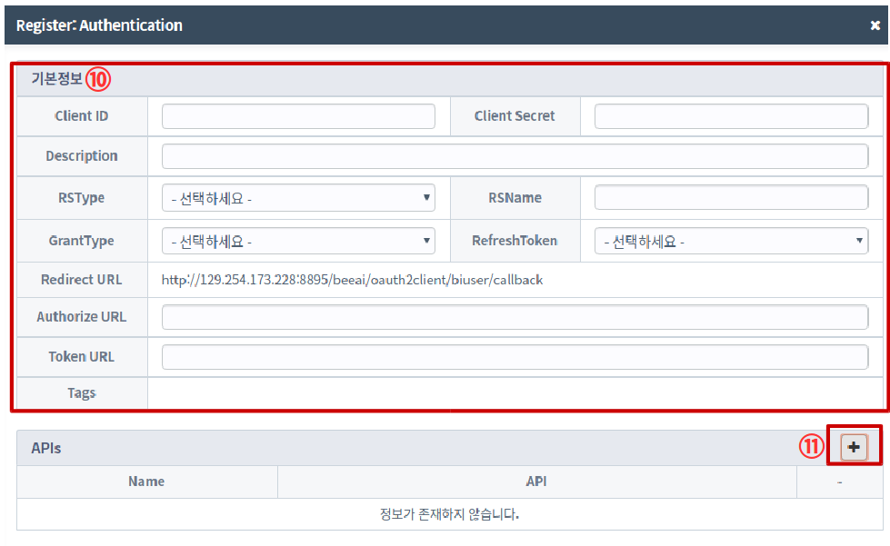

 **⑪** 을 누르면, 아래와 Authentication과 연결할 수있는 API 리스트 화면이 아래오 같이 나타납니다.
 Authentication 과 연결하고자 하는 API 들을  **⑫** 의 체크박스에서 체크하고,  **⑬** Connect 버튼을 클릭합니다.

 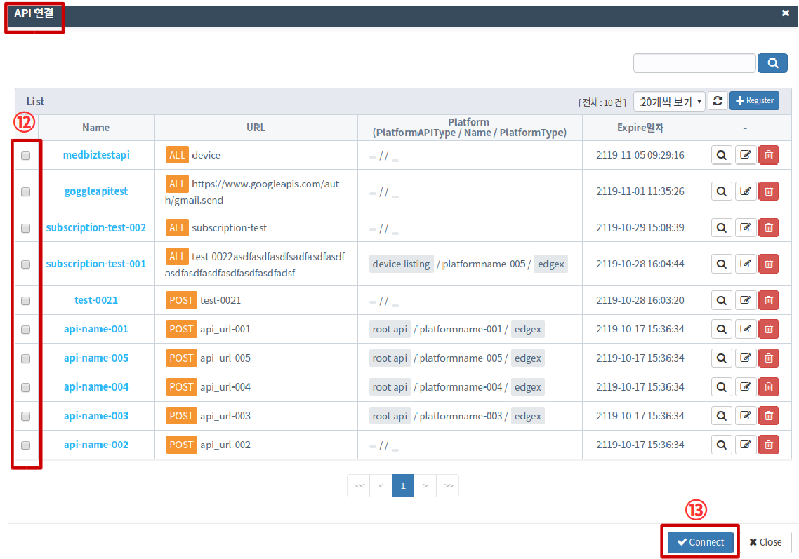

저장되어있는 Authentication 정보를 수정하려면, **&#10114;** Edit 버튼을 클릭해서 수행 할 수 있습니다. **&#10115;** 돋보기 버튼은 Authentication 의 상세 정보를 확인하는데 사용됩니다. **&#10120;** 를 이용하면, API와 Authentication 연결 정보를 해제할 수 있습니다.

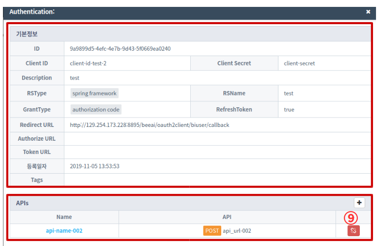

Authentication 에 대한 Token 을 생성하기 위해서는 **⑥** 버튼을 클릭합니다.
클릭하면, 아래와 같이 Token 정보가 표시되며 **⑭** RequestToken 버튼을 클릭해서 Token 을 생성할 수 있습니다.
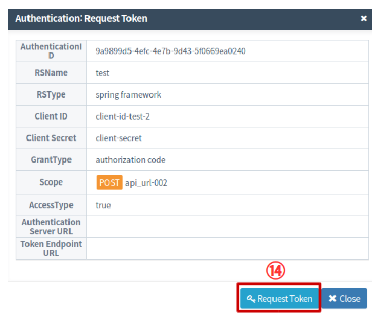

- ### Authentication 리소스 등록 정보 ###

이름  | 설명  | M/O/N(ot) | RW/RO/WO | R(epeated)/N(ot) | 비고  
--|---|--|--|--|--
기본정보  | 리소스의 기본 정보  | M  | RW  | N  | -
API  | 리소스의 Scope에 포함되는 API  | O  | RW  | Y  | -
- 하나의 api는 하나 이상의 authentication 에 속할 수 있다

- ### Authentication 기본정보 ###

이름  | 설명  | M/O/N(ot) | RW/RO/WO | R(epeated)/N(ot) | 비고  
--|---|--|--|--|--
ID  | 시스템에서 자동으로 생성하는 고유 식별자  | N  | RO  | N  | UUID
ClientID  | Authentication 리소스를 식별하기 위한 이름으로 해당 ClientID를 관리하는 OAuth2 인증 서버에서 관리하는 정보 임  | M  | RW  | N  | -
Client Secret  | OAuth2 서버로 부터 token을 발급받기 위해 OAuth2 인증 서버와 교환하는 비공개 정보  | M  | RW  | N  | -
Description  | 리소스에 대한 설명  | O  |RW   | N  | -
RSType  |  ClientID를 통해 접근하고자하는 Resource Server의 타입으로 Sparing Framework와 Google Standard를 지원 함 |  M | RW  | N  |-  
RSName  | Resource Server 를 식별하기 위한 이름  | M  | RW  | N  | -
GrantType  | OAuth2 를 통해 리소스에 접근할 때의 접근 허용 방식으로 "authorization code", "implicit", "password", "client credentials" 가 있음  | M  | RW  | N  | -
RefreshToken  | "authorization code" 방식에서 refresh token을 발급하는 지 여부  | O  | RW  | N  | -
Redirect URL  | OAuth2 서버가 token을 발급하여 전달하는 주소 | N  | RO  | N  | IN2WISER Security Client 서비스가 관리 
Authorize URL  | OAuth2 서버 상에서 인증을 요청하는 주소  | O | RW  | N  |-  
Token URL  | OAuth2 서버 상에서 token 발급을 요청하는 주소  | O  | RW  | N  | -

## Datasource
인공지능 서비스 제작을 위해 필요한 데이터 소스를 등록하고 관리합니다.

**&#10112;**  +Register 버튼을 클릭하면, **&#10113;** 신규 Datasource 등록을 위한 기본 정보 입력란이 활성화 됩니다.

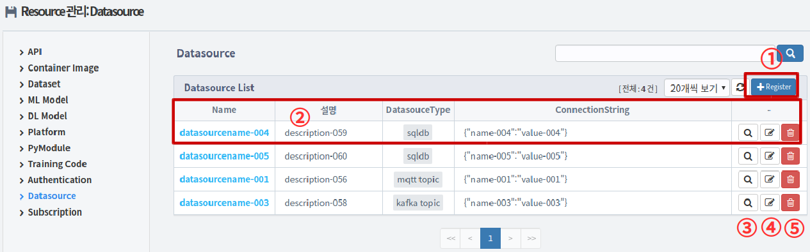

Datasource List 테이블에 보이는 정보는 다음과 같습니다.

이름  | 설명
--|--
Name  |  리소스에 대한 이름
설명  |  리소스에 대한 설명
DatasourceType| 리소스 세부 유형
ConnectionString  | 리소스에 대한 접근 정보

저장되어있는 Datasource 정보를 수정하려면, **&#10115;** Edit 버튼을 클릭해서 수행 할 수 있습니다. **&#10114;** 돋보기 버튼은 Datasource 의 상세 정보를 확인하는데 사용됩니다. **&#10116;** 를 이용하면, Datasource 를 삭제할 수 있습니다.

돋보기 버튼을 클릭하면 Datasource 에 관련된 상세 정보를 표시해주는 다음과 같은 창이 띄워집니다.
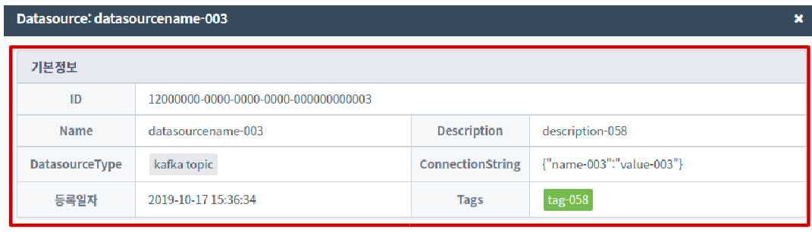

각 항목들의 의미는 다음과 같습니다.
- ### DataSource 리소스 등록 정보 ###

이름  | 설명  | M/O/N(ot) | RW/RO/WO | R(epeated)/N(ot) | 비고  
--|---|--|--|--|--
기본정보  | 리소스의 기본정보  | M  | RW  | N  | -

- ### DataSource 기본정보 ###

이름  | 설명  | M/O/N(ot) | RW/RO/WO | R(epeated)/N(ot) | 비고  
--|---|--|--|--|--
ID  | 시스템에서 자동으로 생성하는 고유 식별자  | N  | RO  | N  | UUID
Name  | 사용자가 부여하는 리소스 이름  | M  | RW  | N  | 시스템 설정에 따라 중복을 허용하지 않을 수 있음
Description  | 리소스에 대한 설명  | O  |RW   | N  | -
DataSourceType  | 리소스 세부 유형으로, sqldb, mongodb, kafka topic, mqtt topic 중 하나를 선택  | M  | RW  | N  |  -
ConnectionString  | 리소스에 대한 접근 정보  | M  | RW  | N  |  Json
등록일자  | 리소스가 시스템에 등록된 일자  | N  | RO  | N  | -  
Tags  | 리소스를 검색하기 위한 키워드  | O  | RW  | Y  | -
- 현재는 API 수준의 리소스 검증 기능은 제공하지 않는다.
- 현재의 ConnectionString은 참고용이다.

## Subscripion
인공지능 서비스 제작을 위해 필요한 subscription 정보를 등록하고 관리합니다.

**&#10112;**  +Register 버튼을 클릭하면, **&#10113;** 신규 Subscription 등록을 위한 기본 정보 입력란이 활성화 됩니다.
저장되어있는 Subscription 정보를 수정하려면, **&#10114;** Edit 버튼을 클릭해서 수행 할 수 있습니다. **&#10115;** 돋보기 버튼은 Subscripion 의 상세 정보를 확인하는데 사용됩니다. **&#10116;** 를 이용하면, 해당 Subscripion 을 삭제할 수 있습니다.

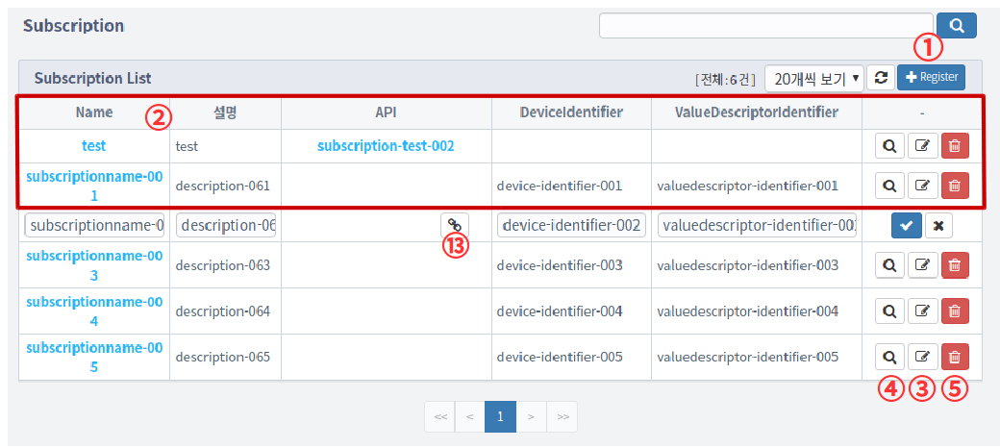

Subscripion List 테이블에 보이는 정보는 다음과 같습니다.

이름  | 설명
--|--
Name  |  리소스에 대한 이름
설명  |  리소스에 대한 설명
API  | Subscription을 수행할 API 리소스  
DeviceIdentifier  | EdgeX 플랫폼 내에서 관리하는 디바이스 유형 이름
ValueDescriptorIdentifier  | EdgeX 플랫폼 내에서 관리하는 값 유형 이름
돋보기 버튼을 클릭하면, 해당 subscription 의 상세정보를 확인하는 화면이 띄워집니다. 화면에는 기본정보와 API 정보가 표현됩니다.
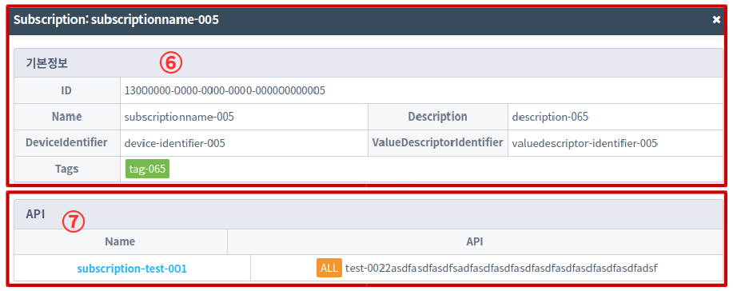

Edit 버큰을 클릭하면, **⑬** API연결 버튼이 보입니다. 이 버튼을 클릭하면, 아래의 화면과 같이
Subscripion과 API 를 연결시킬 수 있는 API 연결창이 뜹니다. 연결하고자 하는 API를 **⑧** 의 라디오버튼 중에서 선택하고, **⑨** Connect 버튼을 클릭하여 연결합니다.
API 에 대한 상세정보는 **⑩** 에서 확인 가능하며, **⑪** 을 통해 API 정보를 수정할 수 있고, **⑫** 를 통해 API 를 삭제할 수 있습니다.

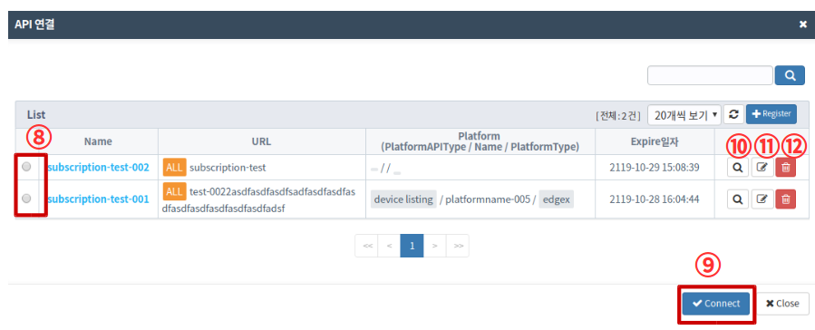

- ### Subscription 리소스 등록 정보 ###

이름  | 설명  | M/O/N(ot) | RW/RO/WO | R(epeated)/N(ot) | 비고  
--|---|--|--|--|--
기본정보  | 리소스의 기본정보  | M  | RW  | N  | -
API | Subscription을 수행할 API 리소스 | O | RW | N | 입력 편이를 위해 Optional이나 실제로는 필수 정보임

- ### Subscription 기본정보 ###

이름  | 설명  | M/O/N(ot) | RW/RO/WO | R(epeated)/N(ot) | 비고  
--|---|--|--|--|--
ID  | 시스템에서 자동으로 생성하는 고유 식별자  | N  | RO  | N  | UUID
Name  | 사용자가 부여하는 리소스 이름  | M  | RW  | N  | 시스템 설정에 따라 중복을 허용하지 않을 수 있음
Description  | 리소스에 대한 설명  | O  |RW   | N  | -
등록일자  | 리소스가 시스템에 등록된 일자  | N  | RO  | N  | -  
Tags  | 리소스를 검색하기 위한 키워드  | O  | RW  | Y  | -