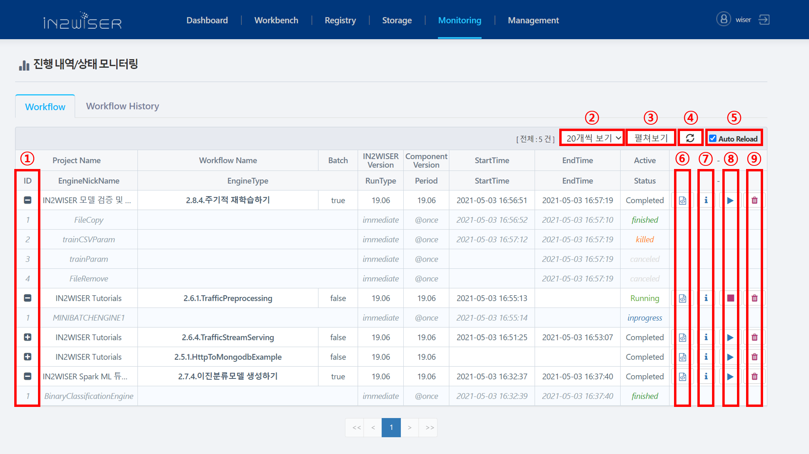
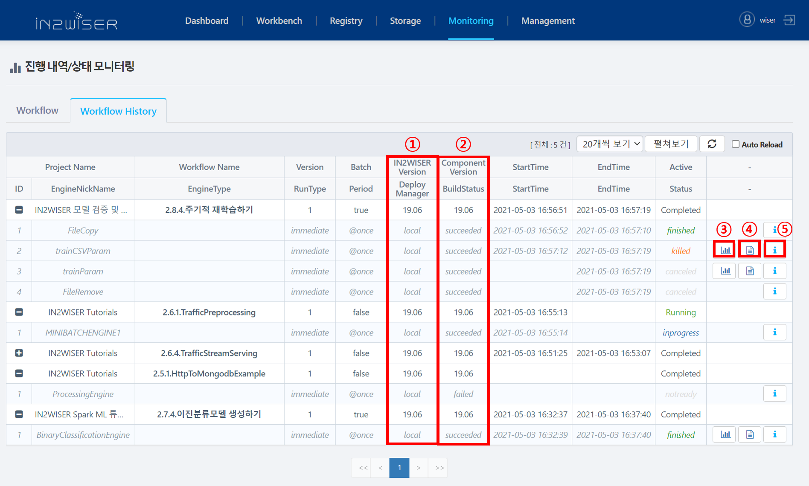
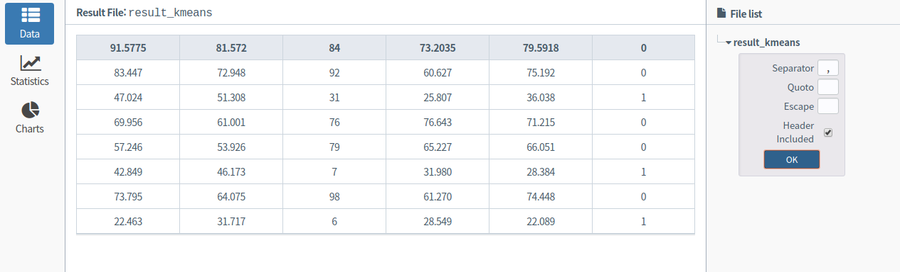
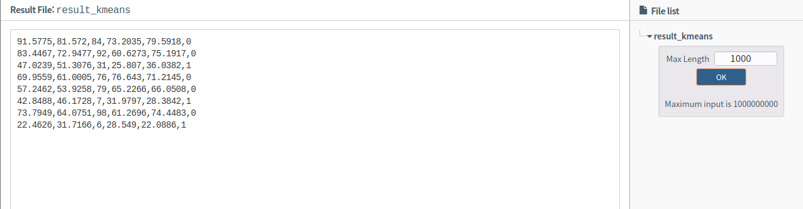
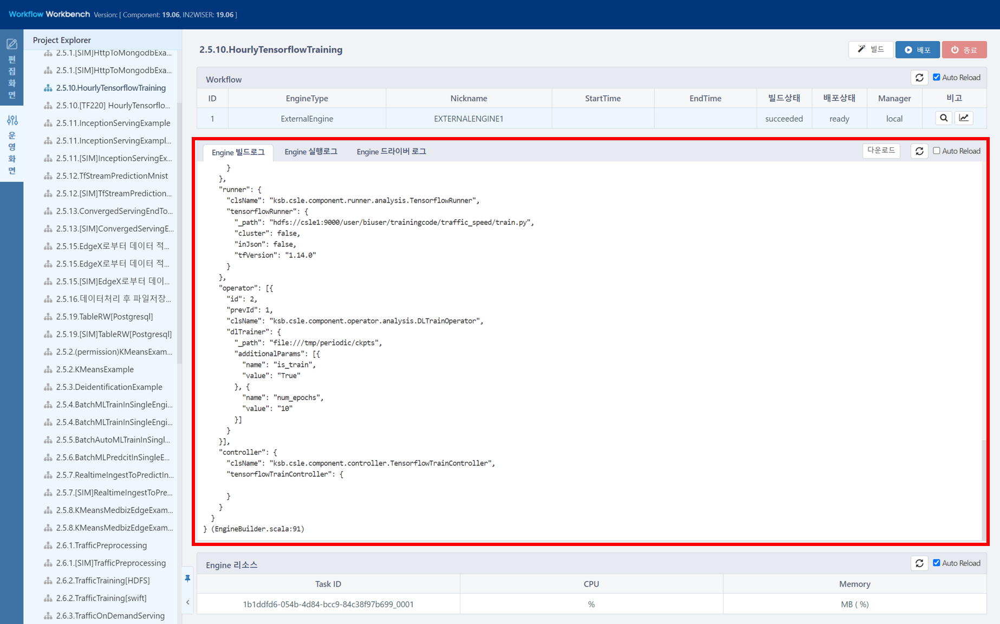
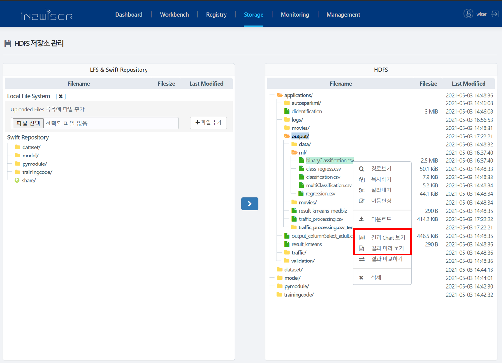

# 모니터링 소개
---
IN2WISER 에 제출된 워크플로우(워크플로우에 속한 엔진 포함)의 목록 및 상태를 확인하고 제어합니다.

각 엔진은 다음과 같은 상태를 가질 수 있습니다.

Engine Status  |  설명
--|---
accepted  |  API 게이트웨이로 엔진이 제출(submit) 된 경우
inprogress  |   엔진이 실행 중인 경우
finished  |  엔진이 에러없이 완료된 경우
failed  |  엔진 실행 중 에러가 발생하여 종료된 경우
killed  |  사용자가 엔진 실행 중 종료한 경우
ready | 엔진 빌드가 성공하였을 경우(배포 전) 
notready | 엔진 빌드가 실패하였을 경우(배포 전) 

워크플로우는 워크플로우에 속한 엔진들의 상태에 따라 다음과 같은 두 가지 상태를 가질 수 있습니다.
- Running
  - 한 엔진이라도 accepted 또는 inprogress 의 상태를 가지는 경우
- Completed
  - 모든 엔진이 finished / failed / killed / ready / notready 중 하나의 상태를 가지는 경우
  - 엔진 정보를 검색할 수 없는 경우

 

## Workflow 탭
진행내역/상태 모니터링의 *workflow* 탭에서는 IN2WISER에 제출된 워크플로우(워크플로우에 속한 엔진 포함)의 목록 및 상태를 확인할 수 있습니다. 또한 실행 중인 워크플로우를 종료(&#9724;)하거나, 다시 실행(&#9654;)할 수 있습니다.

**&#10112; 개별 펼쳐보기/줄여보기 **
워크플로우 이름 앞의 (&#10010;) 버튼을 클릭하면 워크플로우에 속한 엔진의 상세 정보를 확인할 수 있습니다 ("펼쳐보기"). 워크플로우 이름 앞의 (&#8259;) 버튼을 클릭하면 워크플로우에 속한 엔진의 목록을 숨깁니다 ("줄여보기").

**&#10113; 워크플로우 개수 조절**
화면에 보여지는 워크플로우의 개수를 조절할 수 있습니다. 콤보박스를 클릭하여 한 화면에서 보고자 하는 워크플로우 개수를 선택합니다.

**&#10114; 펼쳐보기/줄여보기**
"펼쳐보기" 를 선택하면 워크플로우에 속한 엔진들의 목록을 일괄적으로 펼쳐서 모두 보여줍니다. "줄여보기" 를 선택하면 워크플로우에 속한 엔진들의 목록을 일괄적으로 접고 워크플로우 목록만 보여줍니다.
각 워크플로우를 개별적으로 "펼쳐보기" 하려면 워크플로우 이름 앞의 (&#10010;) 버튼을 클릭합니다. 각 워크플로우를 개별적으로 "줄여보기" 하려면 워크플로우 이름 앞의 (&#8259;) 버튼을 클릭합니다.

**&#10115; 새로고침 **
워크플로우 및 엔진의 현재 상태(Status) 를 업데이트 합니다. 상태 정보는 BeeAI에 요청하여 응답 받은 결과를 보여주는 것입니다. 기본적으로는 모니터링 페이지를 열 때 마다 새로운 정보를 수신하여 표시 합니다.

**&#10116; 자동 새로고침 **
"Auto Reload" 를 체크할 경우 워크플로우 및 엔진의 상태(Status) 를 주기적으로 업데이트 합니다.
참고로, 업데이트 할 주기는 **Management** 메뉴의 **System Configuration** 탭에서 `monitoring.auto.reload.interval` 를 통해 설정합니다. 기본 값은 5000 (5초) 으로 설정되어 있습니다.

**&#10117; 워크플로우 세부 Spec 보기 **
IN2WISER 에서 워크플로우 Spec 을 작성하여 제출한 워크플로우일 경우에 "세부 Spec 보기" 버튼이 활성화 됩니다. (이클립스와 같이 개발자 환경 환경을 통해 워크플로우 Spec 을 작성하여 BeeAI로 제출하거나, 클라이언트 라이브러리를 이용한 경우 "세부 Speck 보기" 버튼이 보이지 않습니다.)
"세부 Spec 보기" 버튼을 클릭하면 **워크플로우 편집기** 에서 작성한 워크플로우의 Json 형태의 Spec 을 보여줍니다.

**&#10118; 로그 보기 **
"Show log" 버튼(&#8505;)을 클릭하면 로그 기록을 보여주는 창이 팝업됩니다. Line 수를 지정하여 보거나 전체 로그 보기가 가능합니다.

**&#10119; 워크플로우/엔진 실행/종료 **
워크플로우 및 엔진의 Status에 따라 실행 중인 워크플로우 및 엔진을 종료(&#9724;)하거나, 재실행(&#9654;)할 수 있습니다.

**&#10120; 워크플로우 삭제**
워크플로우를 목록에서 삭제합니다.

## Workflow History 탭
진행내역/상태 모니터링의 *Workflow Histroy* 탭에서는 최근에 수행한 워크플로우 이력을 엔진 단위로 보여줍니다. (각 엔진은 재실행 될 때 마다 새로운 history id를 부여 받으며, 각 실행이력은 본 Workflow History 탭에서 확인할 수 있습니다.)

**&#10112; IN2WISER 버전과 Deploy Manager 보기 **
워크플로우 제작에 사용된 Component 버전과 Deploy Manager 종류를 보여줍니다. 워크플로우를 배포할 때 IN2WISER의 설정파일(/home/csle/ksb-csle/ok.conf) 에 기입되어 있는 Manager의 유형입니다. 설정파일에서 deploy-mode를 local 로 설정한 경우에는 워크플로우를 구성하는 모든 엔진들의 Deploy Manager 유형이 local 로 표시되며, KAP-E 의 경우는 Deploy Manager 유형을 local 로 설정합니다.

**&#10113; Component 버전과 워크플로우 빌드 상태보기 **
워크플로우 제작에 사용된 Component 버전과 Build 상태를 볼 수있습니다. 워크플로우 빌드 상태는 succeeded/ failed 로 구성됩니다.

**&#10114; 결과 Chart 보기 **
FileWriter 를 포함하고 있는 엔진일 경우에 "결과 Chart 보기" 버튼이 활성화 됩니다. CSV 파일로 결과를 출력한 경우, 결과 파일의 내용을 확인하고 그래프로 시각화 할 수 있습니다. "결과 Chart 보기" 버튼을 클릭하면 차트보기 창이 팝업됩니다. 화면 우측에서 파일명을 선택하고 구분자, 헤더 포함 유무 등을 체크한 후 "OK" 버튼을 누릅니다.
어 있습니다.

화면 좌측에서 "Data" 는 파일의 내용을 표로 보여줍니다. "Statistics" 는 통계 정보를 보여줍니다. "Chart" 는 "Chart Style" 을 선택하여 그래프를 그려줍니다.  

**&#10115; 결과 미리 보기 **
FileWriter 를 포함하고 있는 엔진일 경우에 "결과 미리 보기" 버튼이 활성화 됩니다. "결과 미리 보기" 버튼을 클릭하면 파일의 내용을 보여주는 창이 팝업됩니다. 화면 우측에서 파일명을 선택하고 최대로 보고자 하는 길이 (Max Length) 를 입력합니다. 디폴트로 1000 바이트가 설정되어 있습니다.

**&#10116; 로그 보기 **
"Show log" 버튼(&#8505;)을 클릭하면 Workbench 운영화면으로 이동됩니다. 운영화면에서 워크플로우를 구성하는 엔진들의 'Engine빌드로그', 'Engine실행로그', 'Engine드라이버로그' 를 확인 할 수 있습니다.

### 결과 파일 확인
워크플로우 실행 결과 생성된 파일은 **Monitoring** 메뉴의 *Workflow Histroy* 탭의 "결과 Chart 보기" 버튼과 "TEXT 결과 파일 보기" 버튼을 이용하여 확인할 수 있습니다.

또한  **Storage** 메뉴의 저장소 관리 화면에서 결과 파일이 있는 위치로 이동하여 파일 이름 옆에 나타나는 "결과 Chart 보기" 버튼과 "결과 미리 보기" 버튼을 이용하여 확인할 수 있습니다.

