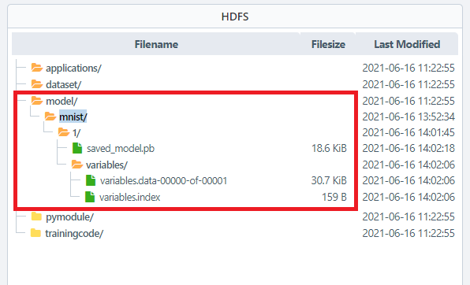
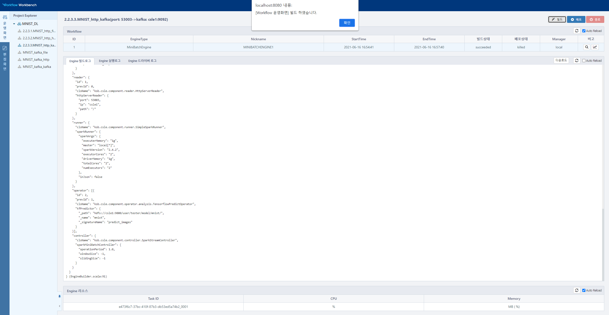
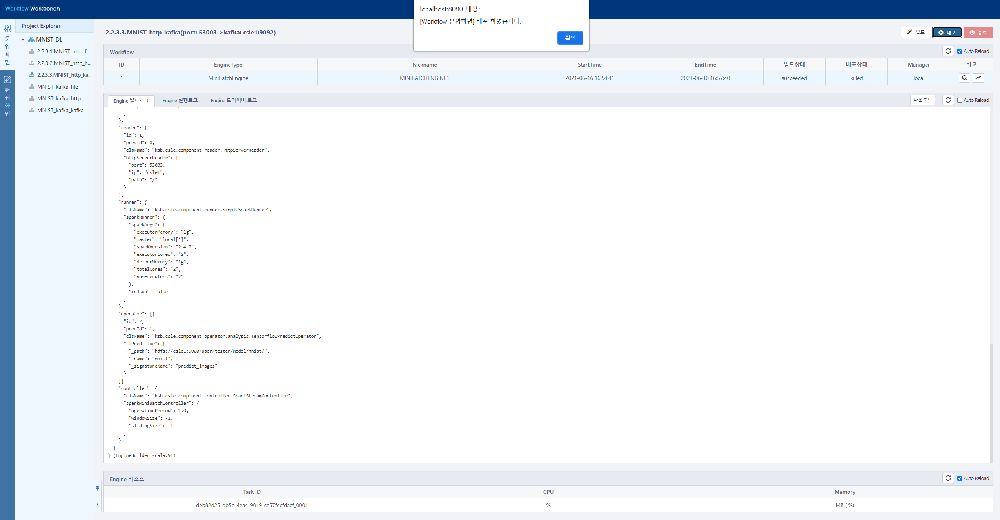
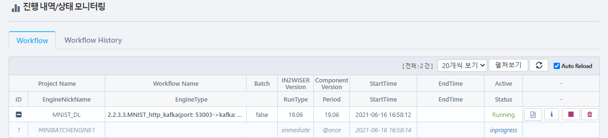
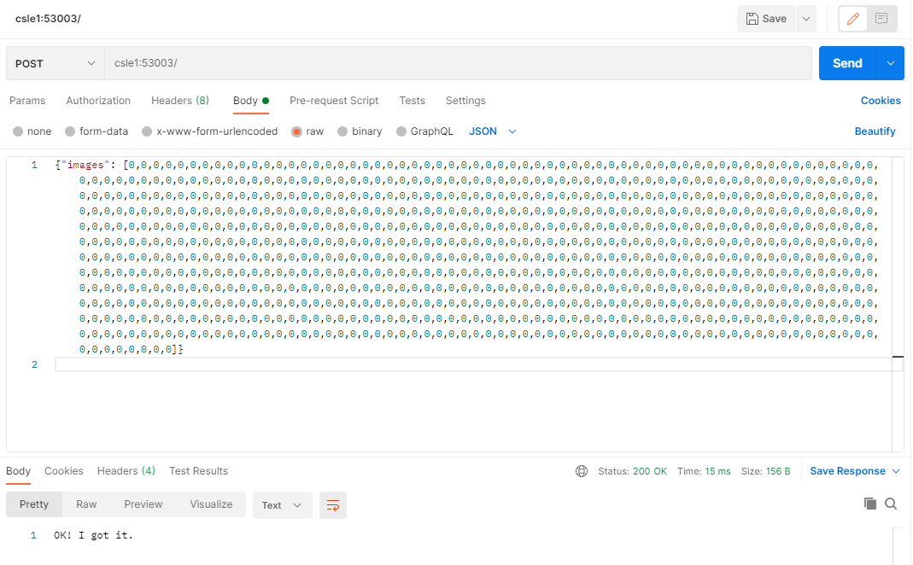
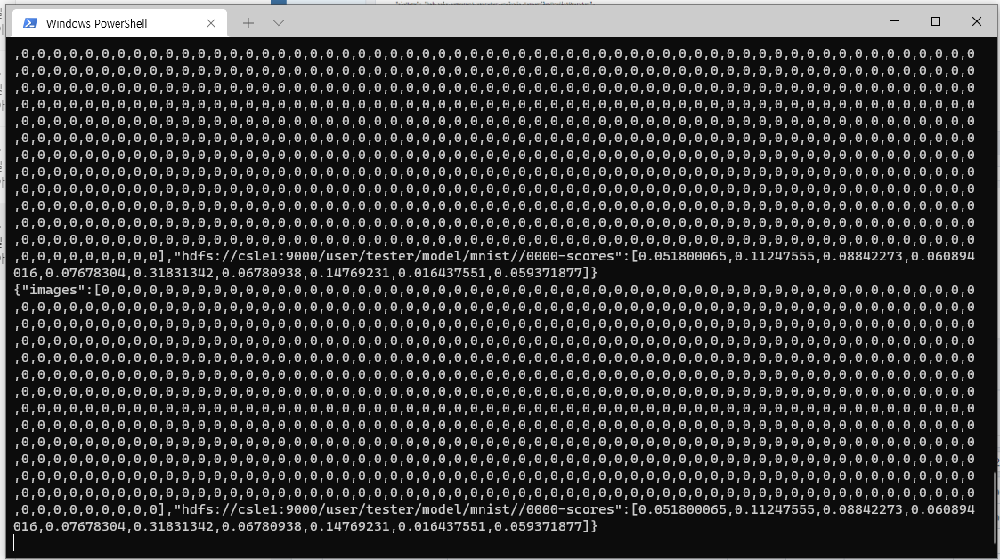

# MNIST를 이용한 딥러닝 모델 예제 (REST방식으로 입력받아 kafka로 결과 값 전달하기) 
---

해당 예제는 MNIST 모델을 이용한 이미지 예측입니다. 

입력으로 postman을 이용하여 해당 workflow 에 데이터를 전달하며, 출력으로 결과 값을 kafka에 전달합니다.

  

 

## 모델 등록하기 
IN2WISER Webtoolkit 화면에서 [Storage] 탭을 선택하여, MNIST 데이터셋을 학습한 딥러닝 모델을 등록합니다.

  

 

## 워크플로우 실행 및 모니터링하기
<h3>워크플로우 빌드하기</h3>

워크플로우를 빌드하기 위해서는 워크벤치 운영화면의 <b>빌드</b>버튼을 선택합니다. <b>Engine 빌드로그</b> 에서 확인할 수 있습니다.

  

<h3>워크플로우 배포하기</h3>

워크플로우를 배포하기 위해서는 워크벤치 운영화면의 <b>배포</b>버튼을 선택합니다. <b>Engine 실행로그, Engine 드라이버로그</b> 에서 확인할 수 있습니다.

  

<h3>워크플로우 모니터링하기</h3>

IN2WISER 상단의 "Monitoring" 탭에서 워크플로우의 진행 내역/상태를 확인할 수 있습니다.

 

 

 

## 결과 확인하기
<h3> 입력 데이터 전달하기</h3>

Postman을 이용하여 예측하고자 하는 데이터를 body에 포함하여 POST 방식으로 워크플로우 reader에 설정한 server에 전달합니다.

해당 워크플로우 예제는 csle1:53003로 request를 받습니다.

* Workflow 입력 Server 정보

  | 속성      | 값    | 비고                   |
  | --------- | ----- | ---------------------- |
  | 메소드    | POST  | HTTP 메소드            |
  | 서버 IP   | csle1 | 서버 IP                |
  | 서버 PORT | 53003 | 서버 PORT              |
  | body      |       | 예측하고자 하는 데이터 |

  

 

 

<h3>kafka를 이용하여 결과 확인하기</h3>

워크플로우가 성공적으로 실행되었다면, kafka를 통해 결과를 확인할 수 있습니다.  

해당 예제의 kafka 설정은 다음과 같습니다.

| 속성             | 값           | 비고                                          |
| ---------------- | ------------ | --------------------------------------------- |
| bootStrapServers | csle1:9092   | 해당 예제에서 동작하는 kafka의 ip 및 port     |
| zookeeperConnect | csle1:2181   | 해당 예제에서 동작하는 zookeeper의 ip 및 port |
| groupId          | mnist_output | 해당 예제에서 설정한 groupId 명               |
| topic            | mnist_output | 해당 예제에서 설정한 topic 명                 |

 

아래의 명령을 통해 결과를 확인할 수 있습니다.

> ~\kafka-console-consumer.bat --bootstrap-server csle1:9092 --topic mnist_output --from-beginning

 kafka를 통한 결과 화면 입니다.

 

 

 

## 워크플로우 종료하기
IN2WISER  웹툴킷의 "Monitoring" -> "Workflow" 탭에서 현재 Status가 Inprogress인 2.2.3.3.MNIST_http_kafka(port: 53003->kafka: csle1:9092) 워크플로우의 정지버튼(&#9724;)을 클릭하여 종료시킵니다.

 

 

 