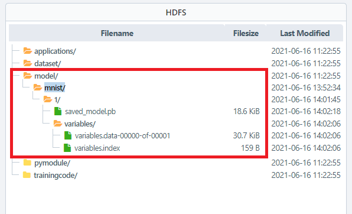

# MNIST를 이용한 딥러닝 모델 예제 (kafka로 입력받아 file로 결과 값 저장하기) 
---

해당 예제는 MNIST 모델을 이용한 이미지 예측입니다. 

입력으로 kafka를 이용하여 해당 workflow 에 데이터를 전달하며, 출력으로 결과 값을 file로 저장하는 예제입니다.

  

 

## 모델 등록하기 
IN2WISER Webtoolkit 화면에서 [Storage] 탭을 선택하여, MNIST 데이터셋을 학습한 딥러닝 모델을 등록합니다.

  

 

## 워크플로우 실행 및 모니터링하기
<h3>워크플로우 빌드하기</h3>

워크플로우를 빌드하기 위해서는 워크벤치 운영화면의 <b>빌드</b>버튼을 선택합니다. <b>Engine 빌드로그</b> 에서 확인할 수 있습니다.

  

<h3>워크플로우 배포하기</h3>

워크플로우를 배포하기 위해서는 워크벤치 운영화면의 <b>배포</b>버튼을 선택합니다. <b>Engine 실행로그, Engine 드라이버로그</b> 에서 확인할 수 있습니다.

  

<h3>워크플로우 모니터링하기</h3>

IN2WISER 상단의 "Monitoring" 탭에서 워크플로우의 진행 내역/상태를 확인할 수 있습니다.

 

 

 

## 결과 확인하기
<h3> kafka로 입력 데이터 전달하기</h3>

kafka를 이용하여 예측하고자 하는 데이터를 전달합니다.

해당 예제의 kafka 정보는 아래와 같습니다.

* kafka 설정 정보

  | 속성             | 값          | 비고                                        |
  | ---------------- | ----------- | ------------------------------------------- |
  | bootStrapServers | csle1:9092  | 해당 예제에서 사용되는 kafka ip 및 port     |
  | zooKeeperConnect | csle1:2181  | 해당 예제에서 사용되는 zookeeper ip 및 port |
  | groupId          | mnist_input | 해당 예제에서 사용되는 groupId 명           |
  | topic            | mnist_input | 해당 예제에서 사용되는 topic 명             |

   
  
  아래와 같이 kafka producer를 통해 데이터를 전달합니다. 전달할 데이터는 mnist_input.json 파일로 저장되어 있습니다.
  
  > cat ~\mnist_input.json | ~\kafka-console-producer.bat --broker-list csle1:9092 --topic mnist_input

 

 

<h3>file로 저장된 결과 확인하기</h3>

워크플로우가 성공적으로 실행되었다면, "Storage"에서 <b>applications/output/mnist/mnist_result_kafka.json</b>파일이 생성된 것을 확인할 수 있습니다. 사전에 <b>applications/output/mnist</b>폴더가 생성되어 있어야 합니다.

 

 

생성된 파일을 우클릭하여, <b>결과 미리보기</b>를 이용해 결과 값을 확인할 수 있습니다.

 

 

 

## 워크플로우 종료하기
IN2WISER  웹툴킷의 "Monitoring" -> "Workflow" 탭에서 현재 Status가 Inprogress인 2.2.3.4.MNIST_kafka_kafka(kafka: csle1:9092 -> file) 워크플로우의 정지버튼(&#9724;)을 클릭하여 종료시킵니다.

 

 

 