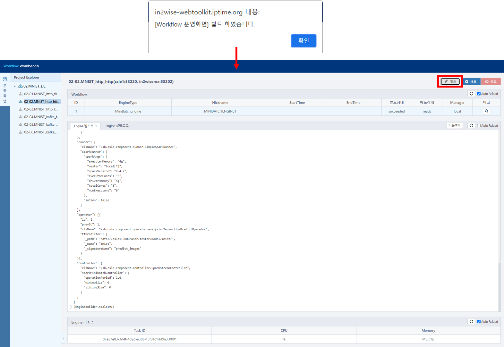
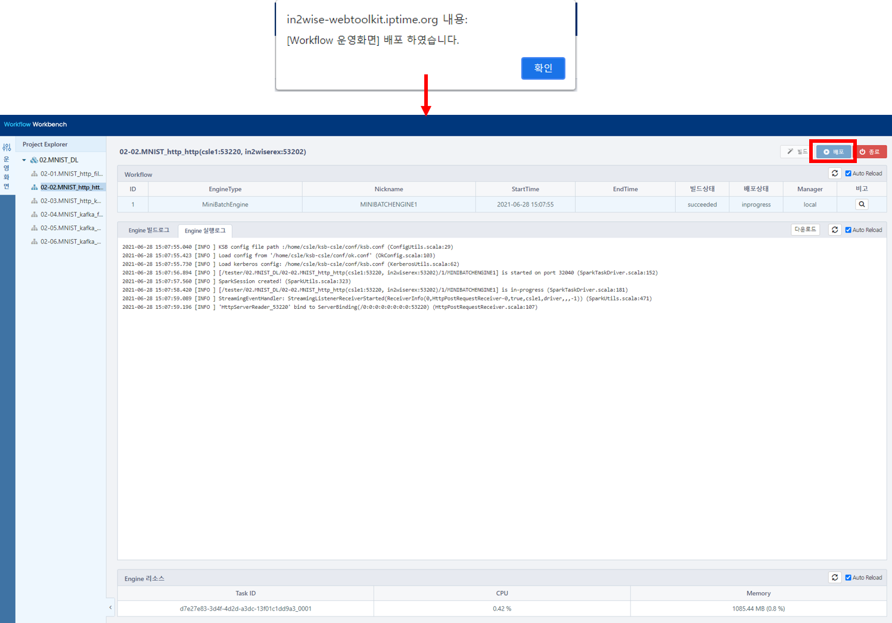

# REST API로 입력받아 HTTP 통신을 통해 결과 전달하기

해당 예제는 MNIST 모델을 이용한 이미지 예측입니다. 

입력으로 HTTP 통신을 이용하며, 워크플로우는 전달받은 데이터에 대한 예측 값을 HTTP 통신을 이용해 예제 서버에 전달합니다.

 

## 예제 서버(in2wiserex) 실행시키기

예제 파일 "http_http_server.py"를 실행시켜 결과 값을 받는 서버를 실행시킵니다.

> //실행방법
>
> \> python http_http_server.py --ip 0.0.0.0 --port 53202 

 

## 워크플로우 빌드하기

IN2WISER 웹툴킷 상단 **Workbench** 의 **운영화면** 탭을 선택하여, **빌드**버튼을 선택합니다. **Engine 빌드로그** 에서 확인할 수 있습니다.

 

## 워크플로우 배포하기

IN2WISER 웹툴킷 상단 **Workbench**의 **운영화면** 탭을 선택하여 빌드를 진행했다면, **배포** 버튼을 선택하여, 워크플로우를 실행시킵니다.  **Engine 실행로그** 에서 확인할 수 있습니다.

 

## 워크플로우 모니터링하기

IN2WISER 웹툴킷 상단 **Monitoring** 탭에서 워크플로우의 진행 내역/상태를 확인할 수 있습니다.

 

## 워크플로우 종료하기

IN2WISER  웹툴킷 상단 **Monitoring** 에서 **Workflow** 탭을 선택하여, 현재 Status가 Inprogress인 02-02.MNIST_http_http(csle1:53220, in2wiserex:53202) 워크플로우의 정지버튼(&#9724;)을 클릭하여 종료시킵니다.

 

## 결과 확인

##  입력 데이터 전달하기

예측하고자 하는 입력 데이터는 예제 파일 "http_post.py"을 이용하여 워크플로우에 전달합니다. 해당 워크플로우 예제는 csle1:53220로 request를 받습니다.

> //실행방법
>
> \>python http_post.py --ip csle1 --port 53220

 

## 예제 서버에서 결과 값 확인하기

워크플로우를 실행시키고, 입력데이터가 전달되면, 예측 결과 값이 예제 서버(in2wiserex) 상에서 로그로 표시됩니다.

> 실행방법
>
> \>python http_http_server.py --ip 0.0.0.0 --port 53202 

 

 

 

