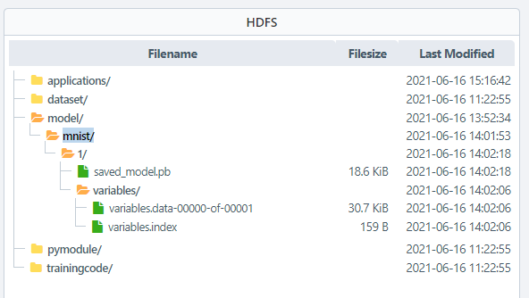
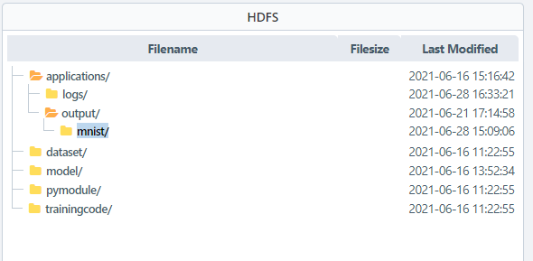
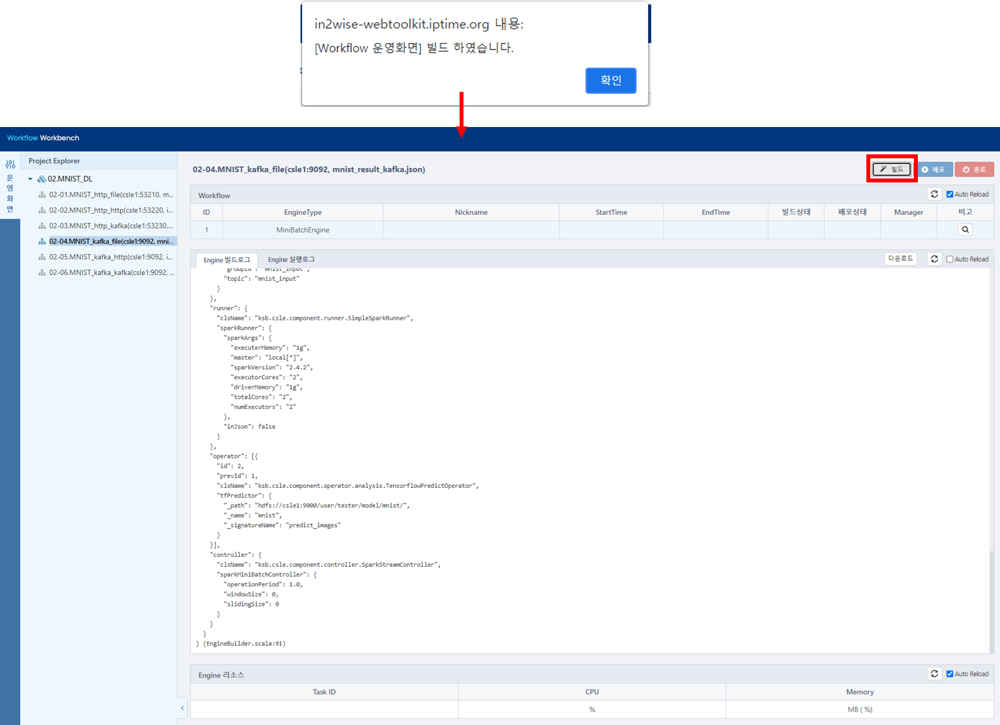
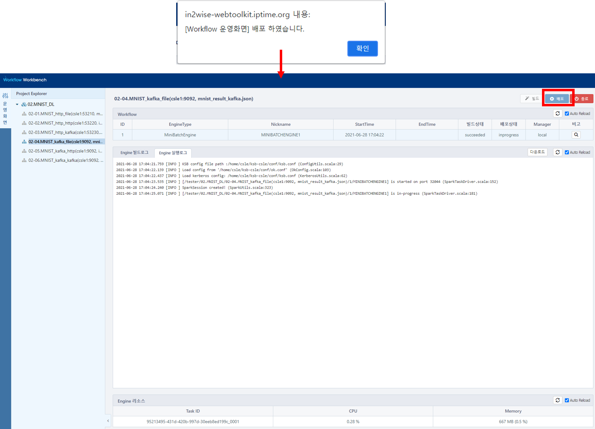
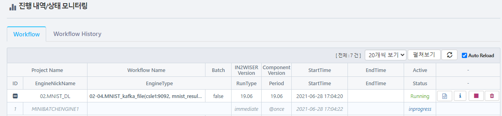
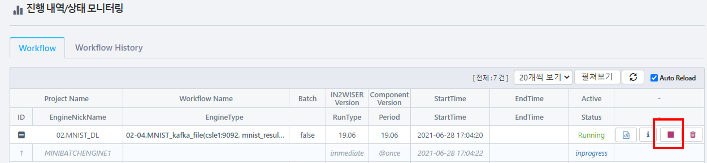
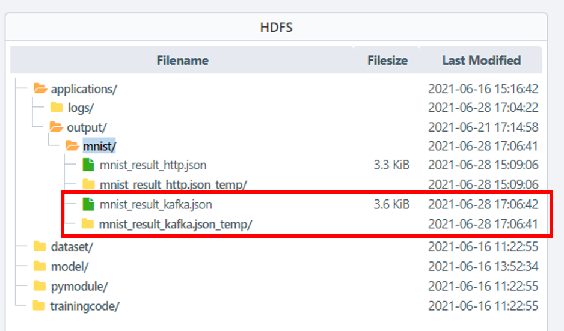
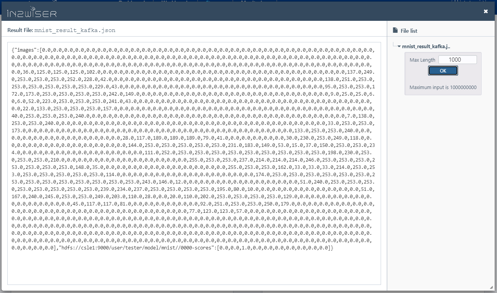

# kafka로 입력받아 파일로 결과 저장하기

해당 예제는 MNIST 모델을 이용한 이미지 예측입니다. 

입력으로 kafka를 이용하며, 워크플로우는 전달받은 데이터에 대한 예측 값을 파일 형태로 출력합니다.

 

## 사전 설정
### 모델 등록하기

IN2WISER Webtoolkit 화면에서 **Storage** 탭을 선택하여, MNIST 데이터셋을 학습한 딥러닝 모델을 등록합니다.

 

### 결과 저장 폴더 생성하기

IN2WISER Webtoolkit 화면에서 **Storage** 탭을 선택하여, applications/output/mnist/ 폴더를 생성합니다.

 

### hosts 등록하기

csle1(in2wiser 설치 서버 IP), in2wiserex (결과 데이터 전달 받는 웹서버 IP) 를 각 pc에 등록하여, hostname으로 통신이 가능하도록 합니다.

>//csle1으로 통신할 pc의 hosts 파일에 등록
>
>x.x.x.x	csle1

 

>//in2wiserex는 in2wiser가 설치되어 있는 pc의 hosts 파일에 등록
>
>x.x.x.x	in2wiserex

 

### kafka topic 설정하기

| 속성             | 설정값      |
| ---------------- | ----------- |
| bootStrapServers | csle1:9092  |
| zooKeeperConnect | csle1:2181  |
| groupId          | mnist_input |
| topic            | mnist_input |

 

## 워크플로우 실행, 모니터링, 종료
### 워크플로우 빌드하기

IN2WISER 웹툴킷 상단 **Workbench** 의 **운영화면** 탭을 선택하여, **빌드**버튼을 선택합니다. **Engine 빌드로그** 에서 확인할 수 있습니다.

 

### 워크플로우 배포하기

IN2WISER 웹툴킷 상단 **Workbench**의 **운영화면** 탭을 선택하여 빌드를 진행했다면, **배포** 버튼을 선택하여, 워크플로우를 실행시킵니다.  **Engine 실행로그** 에서 확인할 수 있습니다.

 

### 워크플로우 모니터링하기

IN2WISER 웹툴킷 상단 **Monitoring** 탭에서 워크플로우의 진행 내역/상태를 확인할 수 있습니다.

 

### 워크플로우 종료하기

IN2WISER  웹툴킷 상단 **Monitoring** 에서 **Workflow** 탭을 선택하여, 현재 Status가 Inprogress인 02-04.MNIST_kafka_file(csle1:9092, mnist_result_kafka.json) 워크플로우의 정지버튼(&#9724;)을 클릭하여 종료시킵니다.

 

## 결과 확인

###  입력 데이터 전달하기

예측하고자 하는 입력 데이터는 예제 파일 "kafka_producer.py"을 이용하여 워크플로우에 전달합니다. 해당 워크플로우 예제는 csle1:9092 의  mnist_input 토픽으로 데이터를 전달받습니다.

>//실행방법
>
>\>python kafka_consumer.py --ip csle1 --port 9092 --groupid mnist_input --topic mnist_input

 

### 결과 데이터 파일 확인하기

워크플로우가 성공적으로 실행되었다면, IN2WISER 웹툴킷 상단 **Storage** 의 HDFS 에서 결과 값이 applications/output/mnist/mnist_result_kafka.json으로 저장됩니다.

 

 

mnist_result_kafka.json 파일을 마우스 우클릭하여, **결과 미리보기** 를 통해 결과 값을 확인할 수 있습니다.

 

 

 
