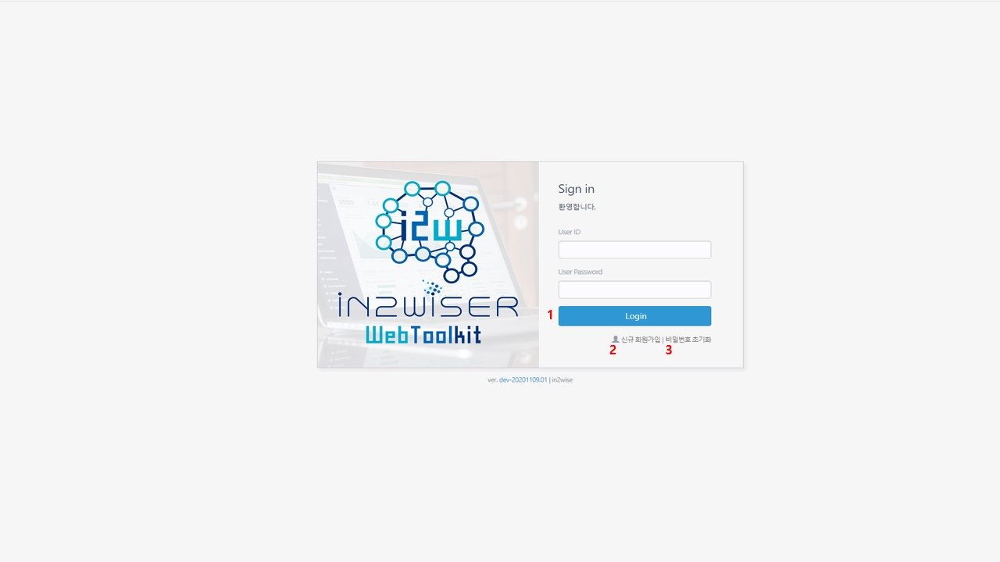
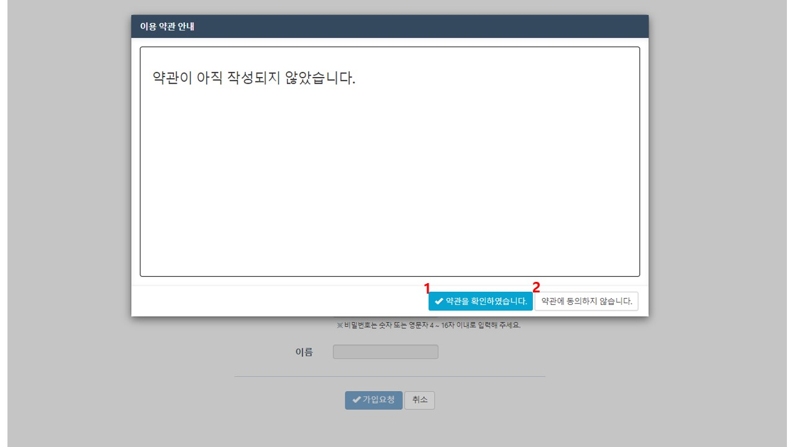
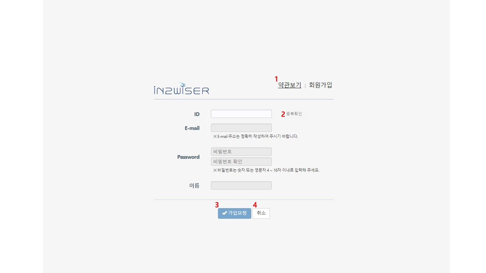
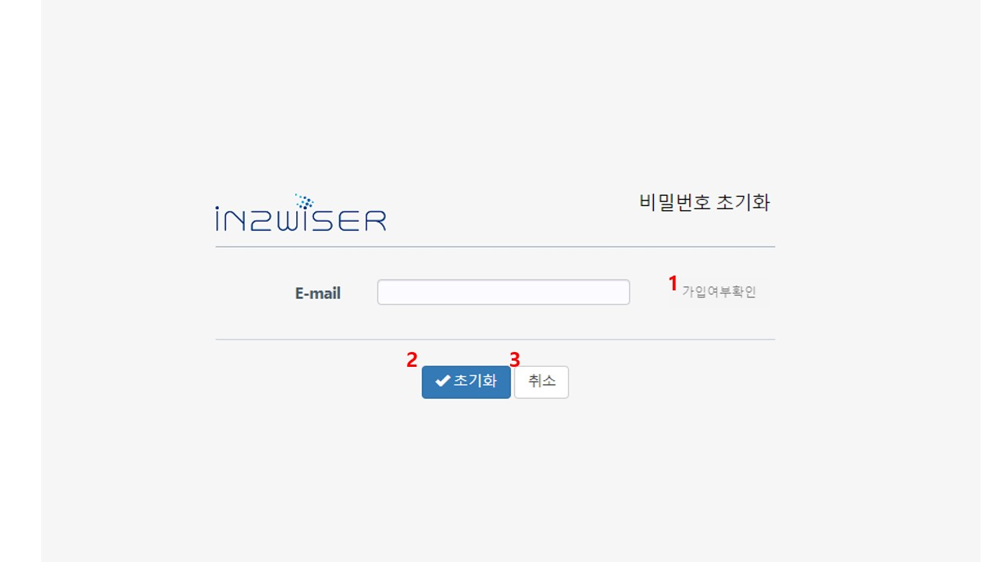

# IN2WISER WebToolkit - 로그인 / 신규 회원가입 / 비밀번호 초기화

**IN2WISER WebToolkit**은 사용자가 프레임워크를 효과적으로 사용할 수 있도록 지원하는 웹기반의 저작 도구입니다. 워크플로우를 정의하고 실행하는 기능과 실행 과정을 모니터링하는 기능, 그리고 관련 데이터를 업로드하고 결과를 시각화하는 기능 등을 지원합니다. 회원가입을 통해 로그인을 하여 사용하며 사용자별로 워크플로우를 관리합니다.

 

## 로그인

 

1. 아이디, 패스워드 입력 후 login 버튼을 입력하여 로그인합니다. 

2. 신규회원가입을 위한 버튼입니다. 

3. 비밀번호를 초기화하기 위한 버튼입니다.

     

    

## 회원가입

로그인 화면에서 <b>신규 회원가입</b> 버튼을 클릭하여 회원가입을 수행 합니다. 신규회원가입에 경우, 이용 약관 안내 팝업 창이 표출됩니다.

 

 

1. <b>약관을 확인하였습니다.</b> 버튼을 선택하면 회원 가입 절차를 진행할 수 있습니다.
2. <b>약관에 동의하지 않습니다.</b> 버튼을 선택하면 로그인 화면으로 돌아갑니다.

 

 

 

1. <b>약관보기</b> 를 선택하면 이용 약관 안내를 확인할 수 있습니다.

2. ID를 입력한 후, <b>중복확인</b>을 선택하여, ID 중복 여부를 확인합니다. 중복 시, 회원가입 절차가 진행되지 않습니다.

3. ID, E-mail, Password, 이름을 입력 후, <b>가입요청</b>을 이용해 가입을 완료합니다.

4. <b>취소</b>를 선택하면, 회원가입 절차가 취소되며, 로그인 화면으로 넘어갑니다.

    가입요청 완료 후 (주)인투와이즈 담당자를 통해 가입 승인을 받으면 회원가입이 완료됩니다.

 

 

 

## 비밀번호 초기화

 

1. E-mail 입력 후, <b>가입여부확인</b>을 통해 E-mail 등록여부를 확인합니다. 
2. <b>초기화</b>를 선택하면, 등록된 E-mail로 초기화를 진행합니다.
3. <b>취소</b> 선택 시, 비밀번호 초기화  진행을 취소합니다.

