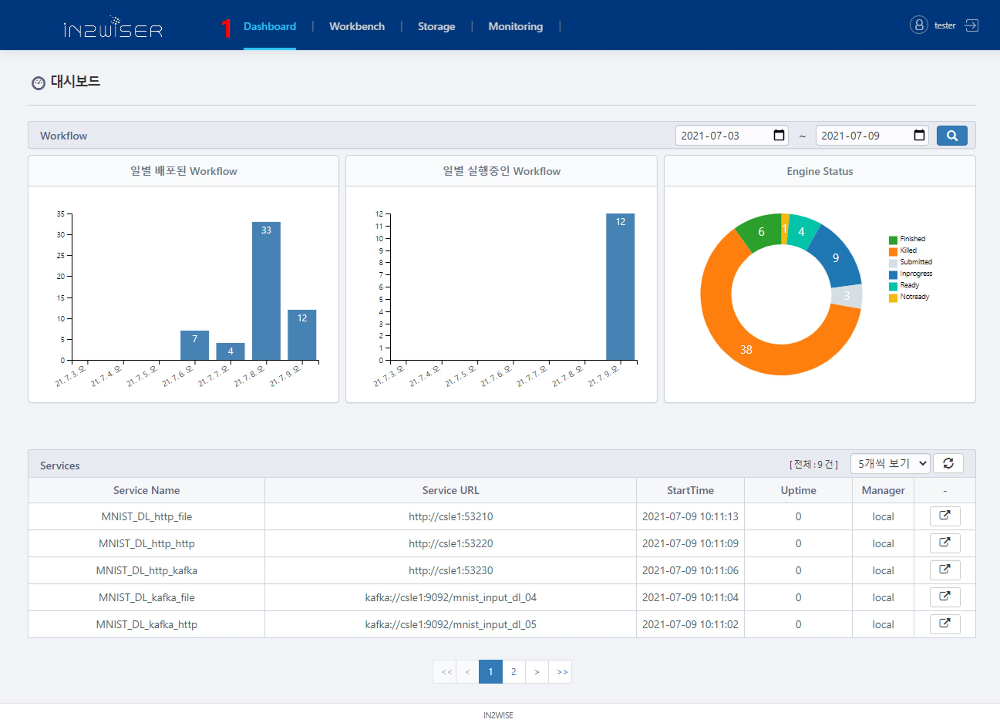
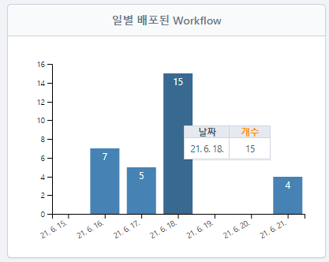
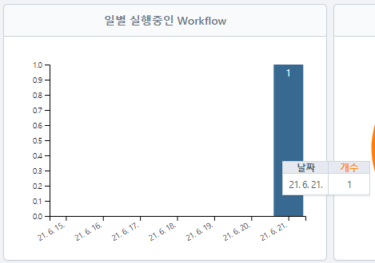
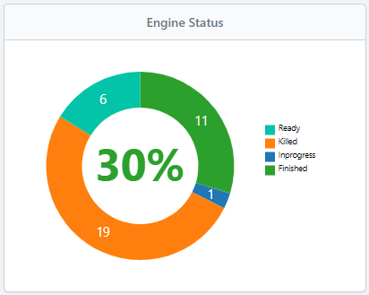
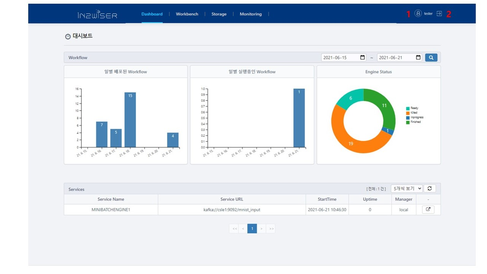
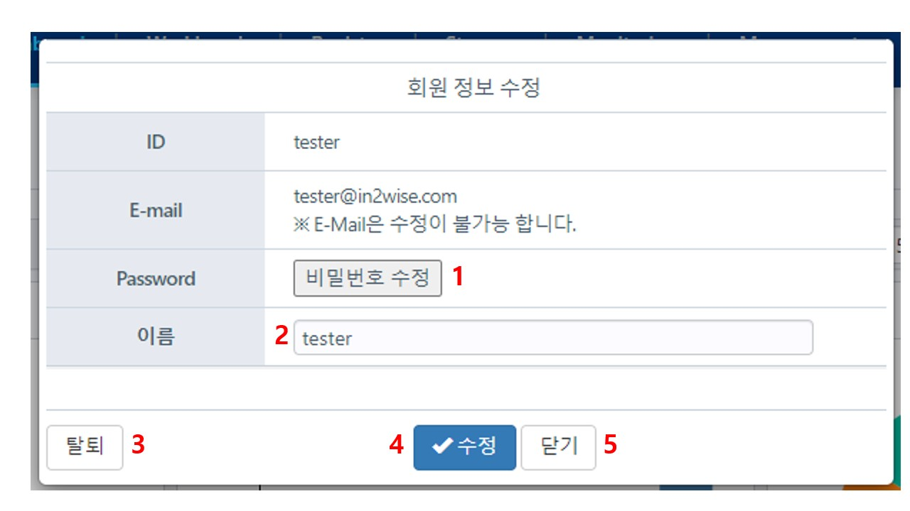
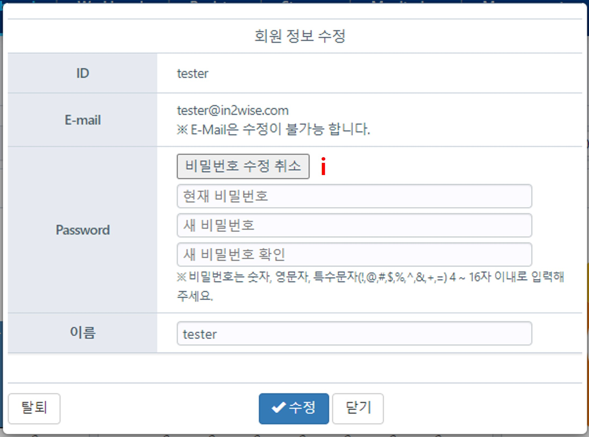
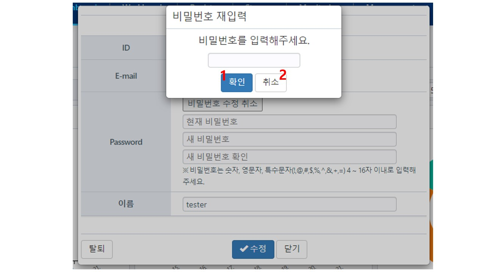
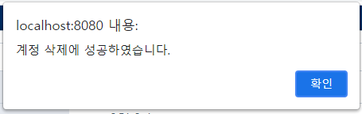

# IN2WISER WebToolkit - 대시보드 / 사용자 정보

**IN2WISER WebToolkit**의 대시보드는 사용자가 실행한 워크플로우에 대한 통계정보(일별 배포/실행 중인 워크플로우 개수, 엔진 상태) 및 현재 서비스 되고 있는 서빙 엔진(온디맨드방식 처리 엔진, 스트림방식 처리 엔진)의 세부 정보를 보여줍니다.

 

## 대시보드

 

1. <b>Dashboard</b>를 선택하면 사용자가 실행한 Workflow에 대한 정보를 확인할 수 있습니다.

2. 검색하고자 하는 날짜를 선택하여 <b>검색버튼</b>을 클릭하면, 해당 기간에 배포/실행중인 Workflow 및 Engine 상태가 시각적으로 표출됩니다.

3. 서비스 중인 서빙 엔진을 리스트로 보여주며, 5, 10, 20, 30 개씩 보기를 이용하여 한 번에 표출할 수 있는 개수를 지정합니다.

4. 표출된 서비스들을 새로고침하는 버튼입니다. 

5. 해당 서비스가 실행되고 있는 Workflow를 확인하기 위해 <b>Monitoring</b> 화면으로 이동합니다. 이때 실행되고 있는 서비스를 포함하는 엔진에 포커스가 맞춰집니다.

6. Services 에 표출된 리스트 페이지 이동 버튼이빈다.

7. 4.에서 검색한 기간 내에 해당하는 <b>일별 배포된 Workflow</b>로써, 마우스를 바에 놓으면, 해당 날짜와 배포된 Workflow 개수가 표출됩니다. 

   

8. 4.에서 검색한 기간 내에 해당하는 <b>일별 실행중인 Workflow</b>로써, 마우스를 바에 놓으면, 해당 날짜 및 실행 중인 Workflow 개수가 표출됩니다.

   

9. 4.에서 검색한 기간 내에 해당하는 <b>Engine Status</b>로써, 마우스를 그래프에 놓으면, 각 Engine 상태의 비중을 백분위로 확인 할 수 있습니다.

   

     

    

## 사용자 정보

IN2WISER Webtoolkit 로그인 이후에는 사용자 정보 우측 상단에 표시되며, 해당 아이콘을 통해 사용자 정보를 변경할 수 있습니다. 또한, 사용자 정보 아이콘 우측에는 로그아웃을 위한 아이콘이 존재하며, 필요에 따라 해당 아이콘을 통해 로그아웃을 진행할  수 있습니다.

 

 

1. 사용자 장보를 확인하는 버튼입니다. 
2. 로그아웃을 수행하는 버튼이며, 클릭 시 로그인 화면으로 전환됩니다.

 

 

<h4>사용자 정보 확인 / 수정하기</h4>

사용자 정보를 확인하는 버튼을 클릭하면, 아래와 같은 화면이 표출됩니다.

1. 비밀번호를 수정하는 버튼입니다. <b>비밀번호 수정</b> 버튼을 클릭하면, 비밀번호를 변경할 수 있으며, 아래 화면과 같이 현재 비밀번호, 새 비밀번호, 새 비밀번호 확인 입력 칸이 표출됩니다.

   

   1. <b>비밀번호 수정  취소</b> 버튼을 클릭하면, 현재 비밀번호, 새 비밀번호, 새 비밀번호 확인 입력 칸이 사라집니다.  

   

2. 사용자 이름을 변경할 수 있습니다. 

3. 해당 사용자의 탈퇴를 진행하는 버튼입니다.

4. 변경된 내용을 수정 완료 하는 버튼입니다.

5. 변경 사항이 없을 경우, <b>닫기</b> 를 이용하여 창을 닫습니다.

     

<h4>탈퇴하기</h4>

사용자 정보 확인 / 수정에서 탈퇴 버튼을 클릭하면 탈퇴가 진행됩니다. <b>탈퇴</b> 버튼을 클릭하면 아래와 같은 화면이 표출됩니다. 

1. 탈퇴를 원할 경우, 사용자 비밀번호를 입력 칸에 입력하고 <b>확인</b> 버튼을 선택합니다. 탈퇴가 성공적으로 진행되면 아래와 같은 메시지가 표출되며 로그인 화면으로 전환됩니다.

   

2. <b>취소</b> 버튼을 이용해 탈퇴를 취소할 수 있습니다.