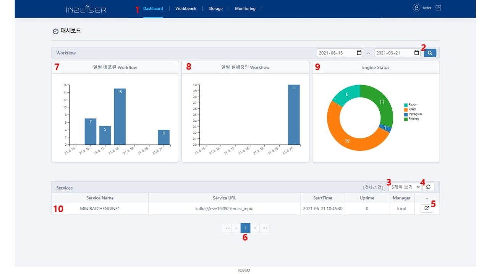
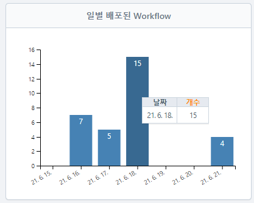
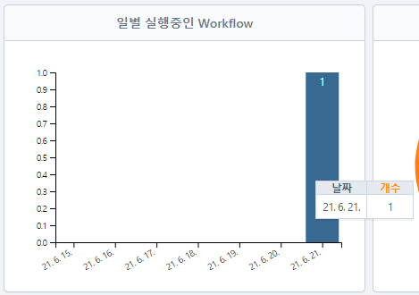
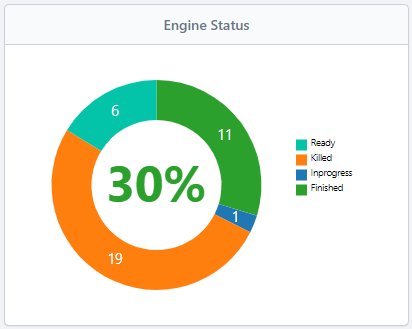

# 대시보드

**IN2WISER WebToolkit**의 대시보드는 사용자가 실행한 워크플로우에 대한 통계정보(일별 배포/실행 중인 워크플로우 개수, 엔진 상태) 및 현재 서비스 되고 있는 서빙 엔진(온디맨드방식 처리 엔진, 스트림방식 처리 엔진)의 세부 정보를 보여줍니다.

 

 

## 대시보드

1. <b>Dashboard</b>를 선택하면 사용자가 실행한 Workflow에 대한 정보를 확인할 수 있습니다.

2. 검색하고자 하는 날짜를 선택하여 <b>검색버튼</b>을 클릭하면, 해당 기간에 배포/실행중인 Workflow 및 Engine 상태가 시각적으로 표출됩니다.

3. 서비스 중인 서빙 엔진을 리스트로 보여주며, 5, 10, 20, 30 개씩 보기를 이용하여 한 번에 표출할 수 있는 개수를 지정합니다.

4. 표출된 서비스들을 새로고침하는 버튼입니다. 

5. 해당 서비스가 실행되고 있는 Workflow를 확인하기 위해 <b>Monitoring</b> 화면으로 이동합니다. 이때 실행되고 있는 서비스를 포함하는 엔진에 포커스가 맞춰집니다.

6. Services 에 표출된 리스트 페이지 이동 버튼이빈다.

7. 4.에서 검색한 기간 내에 해당하는 <b>일별 배포된 Workflow</b>로써, 마우스를 바에 놓으면, 해당 날짜와 배포된 Workflow 개수가 표출됩니다. 

   

8. 4.에서 검색한 기간 내에 해당하는 <b>일별 실행중인 Workflow</b>로써, 마우스를 바에 놓으면, 해당 날짜 및 실행 중인 Workflow 개수가 표출됩니다.

   

9. 4.에서 검색한 기간 내에 해당하는 <b>Engine Status</b>로써, 마우스를 그래프에 놓으면, 각 Engine 상태의 비중을 백분위로 확인 할 수 있습니다.

   

 

 

2. 

 

 

 
