---

sort: 3

---

# 스토리지

IN2WISER는 **하둡파일시스템(HDFS)** 을 기본 저장소로 사용합니다. HDFS 저장소에서는 사용자의 로컬파일시스템과 Swift 저장소에 저장되어있는 파일이나 폴더를 HDFS에 업로드 하거나 다운로드 하기 위한 인터페이스를 제공합니다. 워크플로우에서 사용하는 데이터 파일, 모델 파일, 워크플로우 실행 결과 파일, 코드 등을 관리할 수 있습니다. 사용자가 원하는 파일 내용을 확인하거나 신규 디렉토리를 생성하고 파일을 업로드할 수 있는 기능 등을 제공합니다.

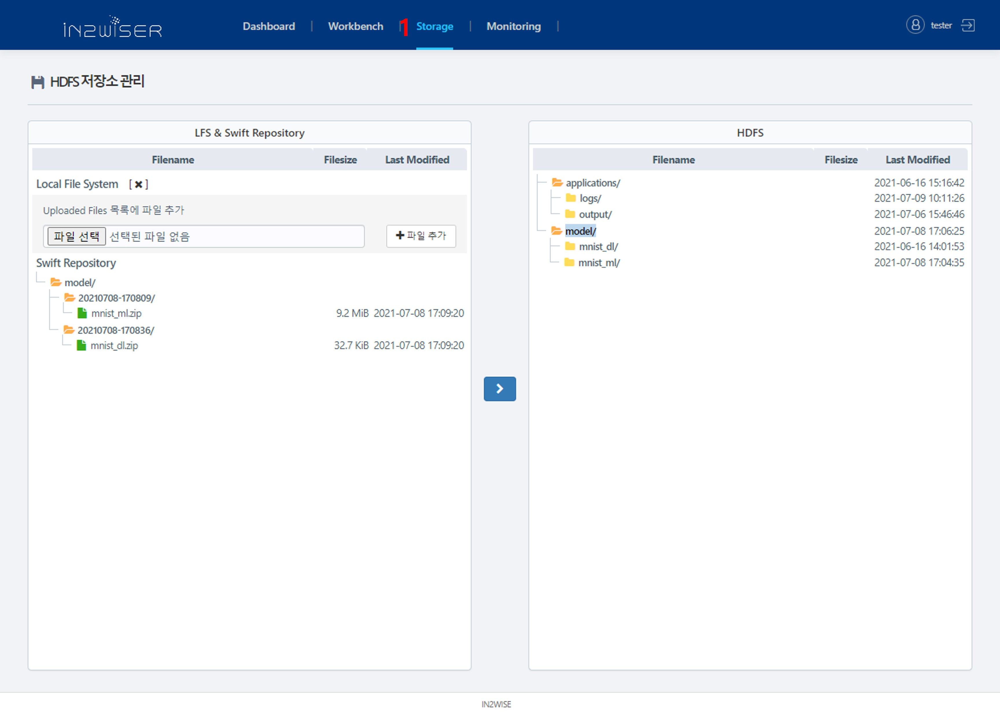

1. IN2WISER Webtoolkit 상단의 **Storage** 탭을 선택하면 위와 같은 화면이 표출됩니다.

 

## Local File System

사용자 Host PC 에 존재하는 File을 IN2WISER Webtoolkit의 HDFS에 업로드하여 Workflow를 실행할 때 사용할 수 있습니다.

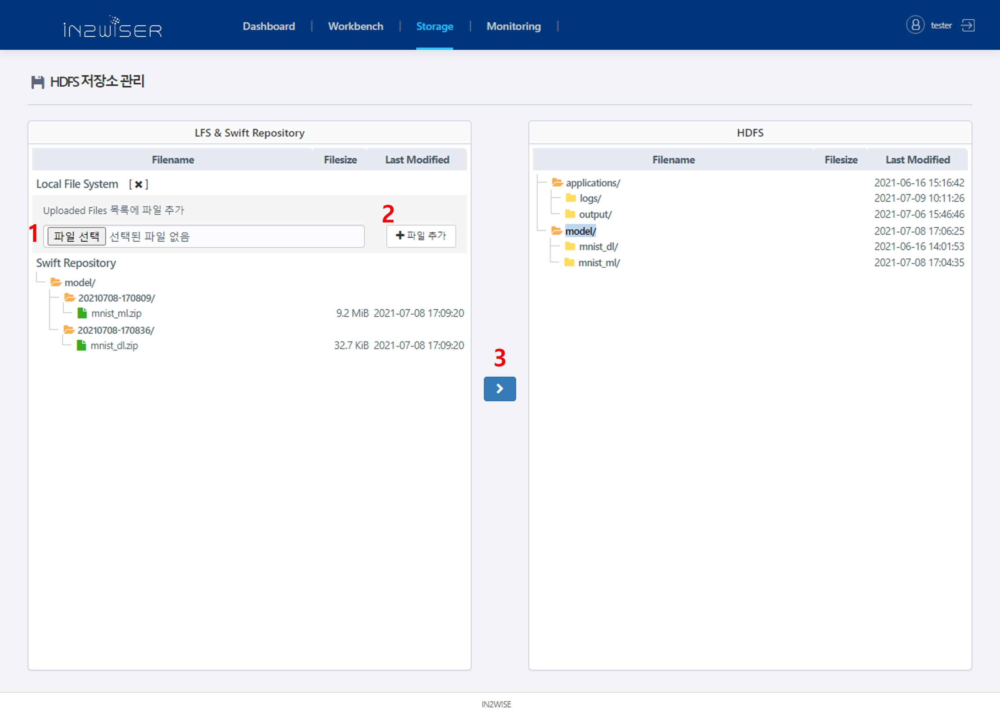

1. **파일 선택** 버튼을 클릭하면 사용자 PC에 있는 파일을 선택할 수 있습니다.
2. **파일 추가** 버튼을 클릭하면 사용자 PC에서 불러온 파일을 HDFS에 저장할 수 있는 상태가 됩니다.
3. 선택한 파일을 우측 HDFS 에 저장하고자 하는 경로에 선택하고  **>**  버튼을 클릭하면 해당 경로로 파일이 저장됩니다.

1. 파일 선택 및 추가하여 등록된 파일을 마우스 우클릭하여 **x 삭제** 버튼을 선택하면 해당 파일이  Local File System 리스트에서 제거됩니다.
2. 임의의 등록된 파일을 마우스 우클릭하여 **Local 파일 초기화**를 선택하면 Local File System 리스트에 존재하는 모든 파일이 제거됩니다.

1. **X**버튼을 클릭하면 "Uploaded Files 목록에 파일 추가" 부분이 사라집니다. 

2. **+**버튼을 클릭하면 "Uploaded Files 목록에 파일 추가" 부분이 표출됩니다.

   

 

## Swift Repository

서비스를 운용하기 위하여 (주)인투와이즈 관리자가 제공한 model의 저장소입니다. HDFS에 업로드 된 model의 파일이 회손되었을 경우 Swift Repository에 저장된 파일을 다운로드하여 복원할 수 있습니다. 사용자는 Swift Repository에 업로드 된 파일을 임의로 삭제할 수 없습니다.

1. 경로를 확인하고자 하는 폴더를 선택하고 마우스 우클릭 후, **경로보기**를 선택하면 해당 폴더의 경로를 확인할 수 있습니다.  아래 화면은 **경로보기**를 선택했을 때, 나타나는 화면입니다.

   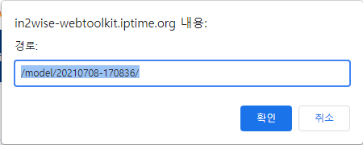

2. 폴더를 선택하고 마우스 우클릭 후, **새로고침**을 선택하면, Swift Repository 내 폴더가 새로고침 됩니다.
3. 폴더를 선택하고 마우스 우클릭 후, **Repository 선택 초기화**를 선택하면, 폴더에 대한 선택이 해지됩니다. 

1. 경로를 보고자 하는 파일을 선택한 후, 마우스 우클릭을 통해 **경로보기** 버튼을 클릭하면 해당 파일의 경로를 확인할 수 있습니다.  아래 화면은 **경로보기** 버튼을 클릭했을 때, 표시되는 화면입니다.

   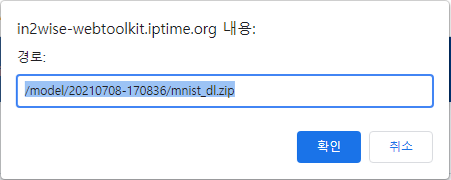

2. 다운로드 받고자 하는 파일을 선택하고 마우스 우클릭을 통해 **다운로드**를 클릭하면 해당 파일을 다운로드 받을 수 있습니다.

3. 선택된 파일을 해지하고자 할 경우, 마우스 우클릭을 통해 **Repository 선택 초기화**를 클릭하면 선택이 해지됩니다.

### Swift로부터 Model 데이터 복원

Workflow에서 사용되는 HDFS 저장소의 model 파일이 회손되거나 삭제되었을 경우 아래와 같이 swift에서 복원할 수 있습니다.

아래는 mnist_dl 폴더 내 파일이 회손되었을 경우의 예를 보여줍니다.

 

1. 회손 된 model 폴더를 삭제합니다.

   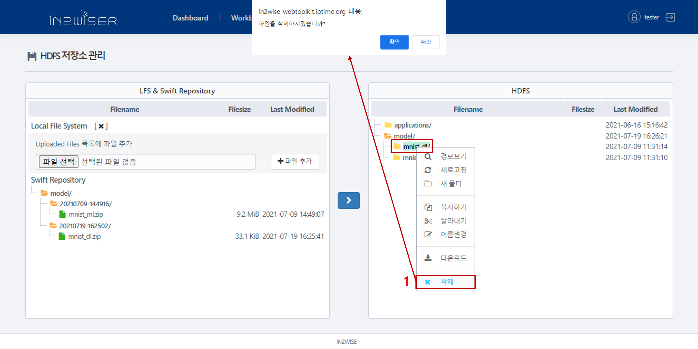

2. HDFS에 이동하고자 하는 Swift Repository 내 저장된 모델 압축파일를 선택합니다.  (동일한 Swift Repository 폴더 내에서는 다중 선택이 가능하며, 선택된 파일 또는 폴더는 아래 그림과 같이 파일명 또는 폴더명에 음영효과가 나타납니다.)

   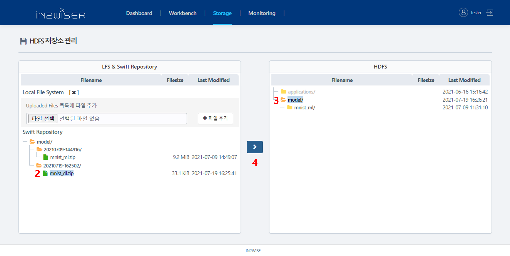

3. HDFS에서 파일을 저장하고자 하는 경로를 선택합니다.

4. **>** 버튼을 이용하여 선택한 HDFS 경로에 Swift Repository에서 선택된 파일/폴더가 이동합니다.

   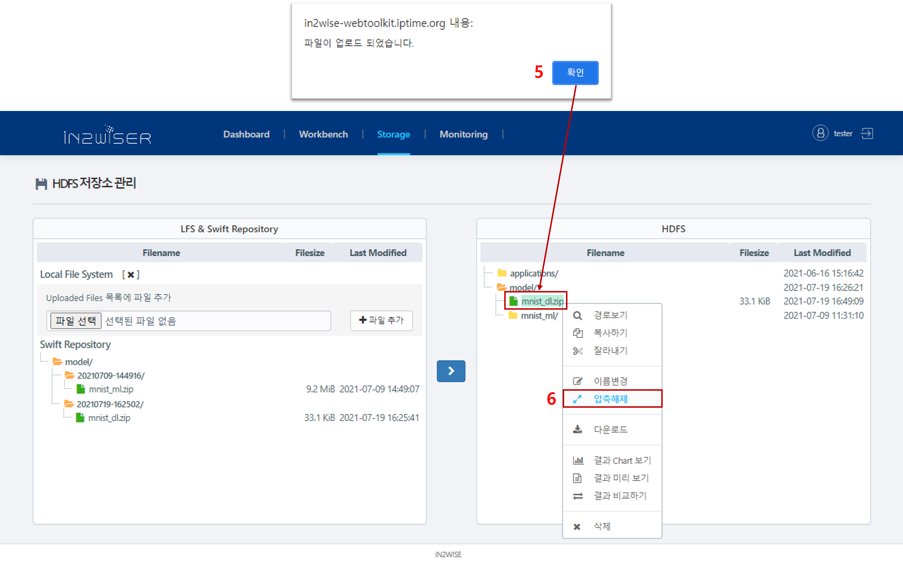

5. Swift의 모델 zip 파일을 선택하여 HDFS에 업로드가 완료되면 해당 폴더 아래 모델 압축파일이 생성됩니다.

6. 업로드한 모델 압축파일의 마우스 오른쪽 버튼을 클릭하고 **압축해제**를 선택합니다.

7. **압축해제**가 정상적으로 완료되면 아래 그림과 같이 기존 폴더와 같은 형식(이름)의 폴더가 생성됩니다.

   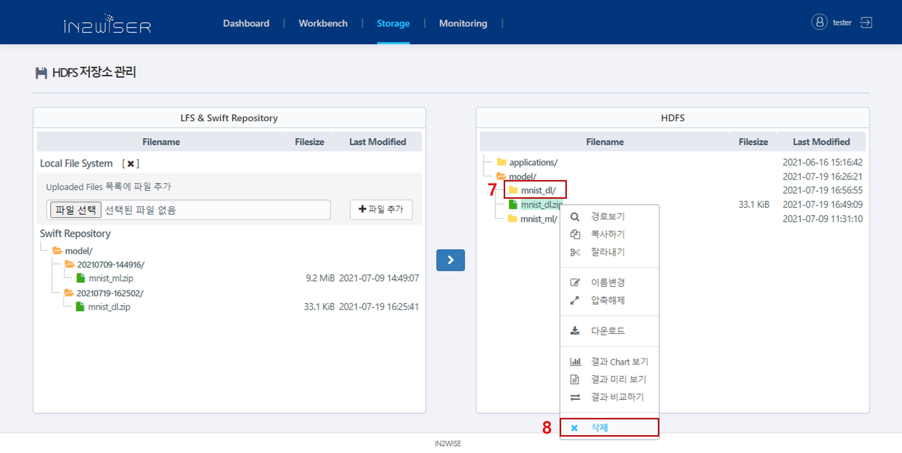

8. 불필요한 모델 압축파일을 삭제합니다.

 

## HDFS

1. HDFS 에서 기본적으로 표시되어 있는 폴더의 경로를 확인하고자 할 경우, 해당 폴더를 선택하고 마우스 우클릭 후, **경로보기**를 선택하면 해당 폴더의 경로를 확인할 수 있습니다. 아래의 화면은 해당 폴더의 경로를 팝업으로 표출합니다.

   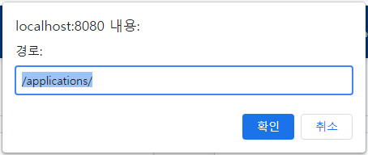

2. HDFS에서 기본적으로 표시되어 있는 폴더를 선택하고 마우스 우클릭 후, **새로고침**을 선택하면 해당 폴더를 새로고침할 수 있습니다.

3. HDFS에서 기본적으로 표시되어 있는 폴더를 선택하고 마우스 우클릭 후, **새폴더**를 선택하면 해당 폴더 하위에 새로운 폴더가 생성됩니다. 아래 화면은 폴더를 새로 생성할 때, 생성할 폴더의 명을 입력하도록 하는 팝업 창입니다. **생성** 선택 시, 입력한 명으로 폴더가 생성되며 **닫기**를 선택할 경우 폴더가 생성되지 않습니다.

   

4. HDFS에서 기본적으로 표시되어 있는 폴더를 선택하고 마우스 우클릭 후, **다운로드**를 선택하면 선택한 폴더를 zip 파일로 하여 다운로드를 진행합니다.

1. 사용자가 생성한 폴더에서 마우스 우클릭 후, **경로보기**를 선택하면 해당 폴더의 경로를 확인할 수 있습니다. 아래 화면은 **경로보기**를 선택하여 표출된 폴더의 경로 팝업 창입니다.

   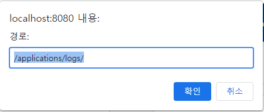

2. 사용자가 생성한 폴더에서 마우스 우클릭 후, **새로고침**을 선택하면 해당 폴더가 새로고침됩니다.

3. 사용자가 생성한 폴더에서 마우스 우클릭 후, **새폴더**를 선택하면 새로운 폴더가 생성됩니다. 아래 화면은 **새폴더** 선택 시, 해당 폴더의 명을 입력하는 팝업 창입니다. 폴더 명을 입력하고 **생성**을 누르면, 해당 명으로 폴더가 생성되며, **닫기**를 누르면 새폴더 생성이 취소됩니다.

   

4. 사용자가 생성한 폴더에서 마우스 우클릭 후, **복사하기**를 선택하면 해당 폴더를 복사할 수 있습니다. 

5. 사용자가 생성한 폴더에서 마우스 우클릭 후, **잘라내기** 를 선택하면 해당 폴더를 잘라낼 수 있습니다.

6. 사용자가 생성한 폴더에서 마우스 우클릭 후, **이름변경**을 선택하면 폴더 명을 변경할 수 있습니다. 아래 화면은 **이름변경**을 선택하여 표출된 팝업 창입니다. 폴더/파일 명을 입력하고 **변경**을 누르면 해당 명으로 변경되며, **닫기**를 누르면 취소됩니다.

   

7. 사용자가 생성한 폴더에서 마우스 우클릭 후, **다운로드**를 선택하면 해당 폴더를 zip 파일로 하여 다운로드 할 수 있습니다.

8. 사용자가 생성한 폴더에서 마우스 우클릭 후, **삭제**를 선택하면 해당 폴더를 삭제할 수 있습니다. 이 때, "파일을 삭제하시겠습니까?" 팝업창이 출력되며, **확인**을 누르면 삭제되고, **취소**를 누르면 취소됩니다.

1. HDFS 내 파일을 선택하고 마우스 우클릭 후, **경로보기**를 선택하면 해당 파일의 경로를 확인할 수 있습니다. 아래 화면은 선택된 파일에 대한 경로 팝업 창입니다.

   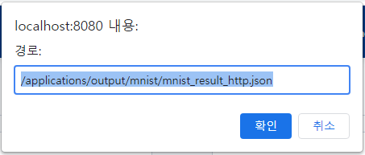

2. HDFS 내 파일을 선택하고 마우스 우클릭 후, **복사하기**를 선택하면 해당 파일을 복사할 수 있습니다. 

3. HDFS 내 파일을 선택하고 마우스 우클릭 후, **잘라내기**를 선택하면 해당 파일을 잘라낼 수 있습니다. 

4. HDFS 내 파일을 선택하고 마우스 우클릭 후, **이름변경**을 선택하면 파일 명을 변경할 수 있습니다. 아래 화면은 파일 명을 변경할 경우 표출되는 팝업 창입니다.

5. HDFS 내 파일을 선택하고 마우스 우클릭 후, **다운로드**를 선택하면 해당 파일을 다운로드 할 수 있습니다.

6. HDFS 내 파일을 선택하고 마우스 우클릭 후, **결과 Chart 보기**를 선택하면 해당 파일의 결과를 Chart 형태로 볼 수 있습니다.

7. HDFS 내 파일을 선택하고 마우스 우클릭 후, **결과 미리 보기**를 선택하면 해당 파일의 결과를 확인할 수 있습니다.

8. HDFS 내 파일을 선택하고 마우스 우클릭 후, **결과 비교하기**를 선택하면 이전에 선택한 파일과 결과를 비교하여 볼 수 있습니다. 이 때, 이전에 선택한 파일 또한 **결과 비교하기**로 선택되어 있어야 합니다.

9. HDFS 내 파일을 선택하고 마우스 우클릭 후, **삭제**를 선택하면 해당 파일을 삭제할 수 있습니다. 삭제 시 팝업창과 함께 "파일을 삭제하시겠습니까?" 메시지가 뜨고 **확인**을 누르면 삭제가 되며, **취소**를 누르면 삭제가 취소됩니다.

### 결과 Chart 보기

1. 결과 Chart 보기 팝업 창에서 데이터를 확인해야 할 경우, **Data**를 선택합니다.
2. **Data**를 선택한 후, 우측 File list에서 파일을 선택하고, Separator, Header Included, Sampling을 입력하여 **OK**를 누르면 설정한 값을 토대로 결과를 확인할 수 있습니다. 
3. 2.에서 설정한 값을 토대로 결과를 표출하는 화면입니다.

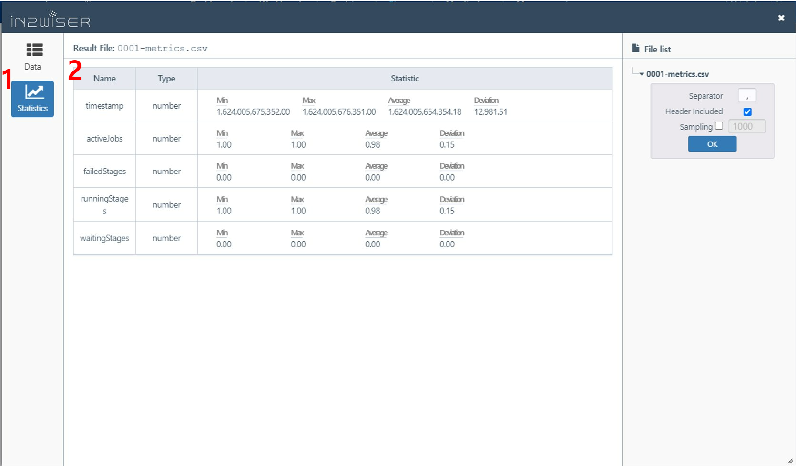

1. 결과 Chart보기 팝업 창에서 좌측 **Data** 에 대한 우측 값(Seperator, Jeader included, Sampling)을 설정하고 좌측 **Statistics**를 선택하면 해당 Data에 대한 통계치를 볼 수 있습니다.
2. 해당 화면은 통계치를 표출하는 화면입니다.

### 결과 미리보기

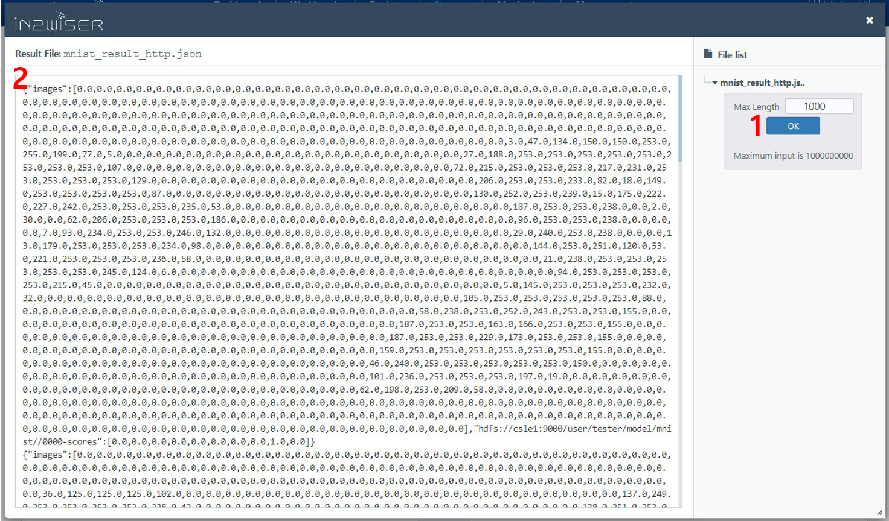

1. Max Length 입력 칸에 출력하고자 하는 최대 길이를 입력하고, **OK**버튼을 누르면 결과를 최대 길이만큼 확인할 수 있습니다.
2. 1.에서 설정한 길이만큼 결과를 출력해주는 부분입니다.

### 결과 비교하기

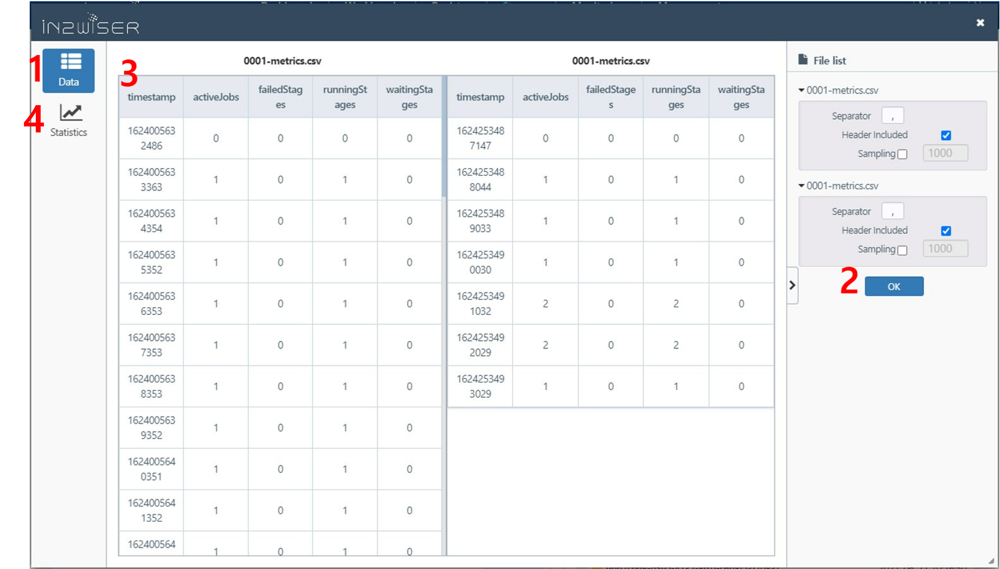

1. 비교하고자 하는 두 파일을 선택하고 **결과 비교하기**를 선택하면 두 파일에 대한 데이터를 **Data**를 통해서 확인할 수 있습니다.
2. 우측 File list에서 원하는 설정값I(Separator, Header Included, Sampling)을 입력하고 **OK**를 선택하면 사용자가 설정한 값을 토대로 데이터를 출력할 수 있습니다.
3. 설정된 값에 따라서 두 파일의 데이터를 표출하는 창입니다.

 

 

 
